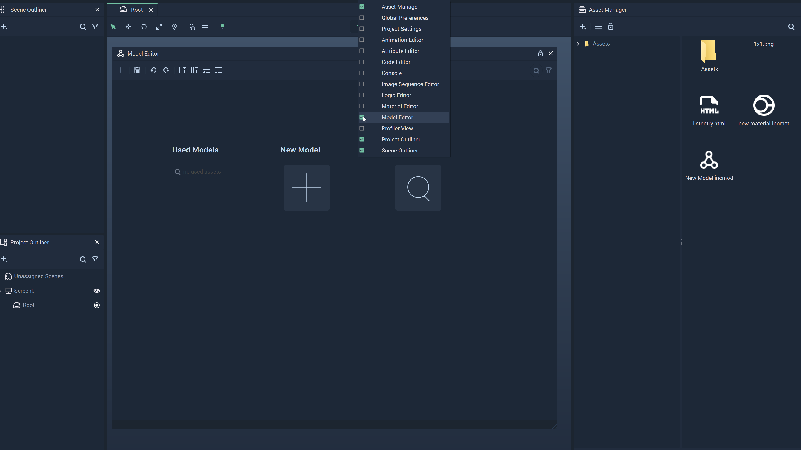

# Model Editor

The **Model Editor** allows the user to set up data in **Fields** \(columns\) and **Records** \(rows\) that will be used later with a **List Object**. The **Model** files have `.incmod` as their filename extension.

To open the **Model Editor**, double-click on a **Model** file in the **Asset Manager** or right-click on the Menu bar in **Incari** and click on **Model Editor** from the drop-down list. This can be seen in the illustration below:

The sections defined in the **Model Editor** are discussed below:

Note: These sections will not be opened if a **Model** file has already been opened in the **Model Editor**.

The `Used Models` section contains **Models** that have been previously applied. These **Models** can be edited by clicking on them.

`New Model`, as its name suggests, allows us to create new **Models**. The illustration below depicts its behavior when clicked.

`Open Model` opens a window that allows us to select an existing **Model** file. An example of the window is shown below:

## See Also

* [**Incari Model File**](https://docs.incari.com/incari-studio/v/2021.3-unreleased/objects-and-types/scene-objects/list-widget#incari-model-file)
* [**List**](../toolbox/events/list/)

