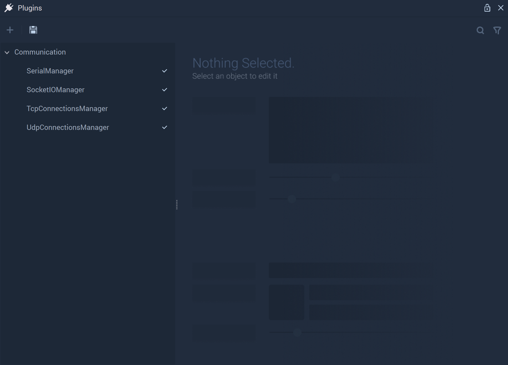

# Communication

**Communication** is governed by the **Plugins Module**, which allows the user to activate or deactivate different components within **Incari**. This provides one with the foundation for a self-scalable structure, combining creativity and functionality to ensure **Incari** supports the user's individual needs.

The **Plugins Module** looks like this when it is opened: 

After clicking the arrow, **Communication** options are revealed. The checkmark is an important visualization of how the **Plugins** function. When a component is activated, a checkmark is present next to the name. If deactivated, the checkmark disappears. This makes it easy to see which components are in use or not without needing to click each one. 

