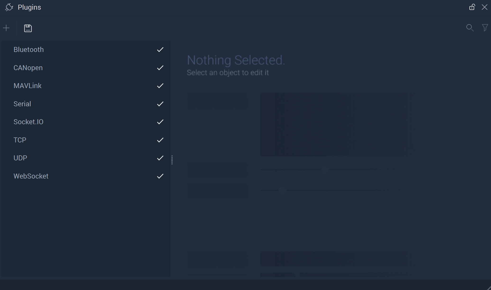

# Communication

After clicking the arrow, **Communication** options are revealed. The checkmark is an important visualization of how the **Plugins** function. When a component is activated, a checkmark is present next to the name. If deactivated, the checkmark disappears. This makes it easy to see which components are in use or not without needing to click each one. 

## Contents

* [**Bluetooth**](bluetooth.md)
* [**CANopen**](canopen.md)
* [**MAVLink**](mavlinkmanager.md)
* [**Serial**](serialmanager.md)
* [**Socket.IO**](socketiomanager.md)
* [**TCP**](tcpconnectionsmanager.md)
* [**UDP**](udpconnectionsmanager.md)
* [**WebSocket**](websocket.md)
