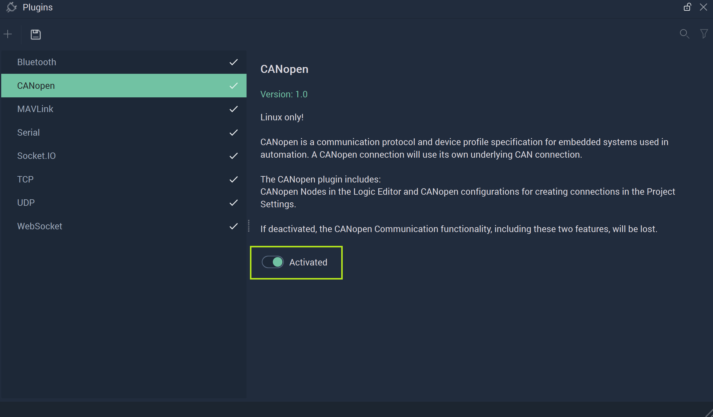
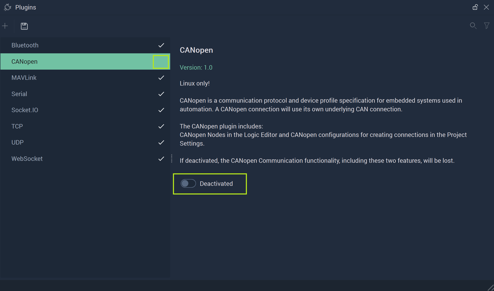

# Socket.IO

After clicking on **CANopen** in the **Plugins Module**, its options will show. All **CANopen Communication** related components are encompassed by the **CANopen Plugin**. 

To refresh, **CANopen Communication** is a form of communication that extends the functionality of the [*CAN*](../../../toolbox/communication/can/README.md) (Controller Area Network) protocol. It provides a standardized framework for defining communication and application layer protocols for devices and systems employing *CAN* as their underlying physical layer. Within **Incari**, this is done by using the [**CANopen Nodes**](../../../toolbox/communication/canopen/README.md) and connections are configured in the [**Project Settings**](../../project-settings/CANopen.md). They add the necessary functionality to a **Project** that requires this type of communication. However, the user may decide that they would rather deactivate this portion of **Incari** to heighten performance and stability. 

To do this, the user needs simply to locate the toggle labeled `Activated` and click it once.  

**Incari** will alert the user of this by outputting this message to the screen:

By following these instructions (save and restart **Incari Studio**) the user will deactivate the **CANopen Plugin**. 

Once the user has followed these steps, they will see that after restarting **Incari Studio** and going to the **Plugins Editor**, the checkmark by **CANopen** will be gone and the toggle labeled `Deactivated`. 

To activate again, the user just needs to repeat this by clicking `Deactivated` and saving and restarting again. 