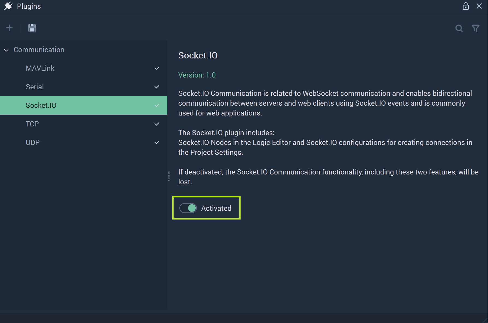
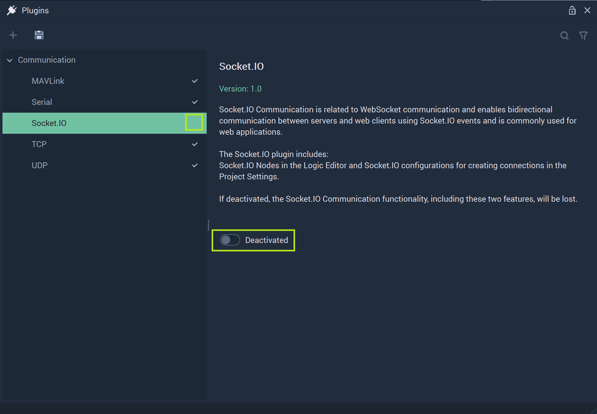

# Socket.IO

After clicking on **Socket.IO** in the **Plugins Module**, its options will show. All **Socket.IO Communication** related components are encompassed by the **Socket.IO Plugin**. 

To refresh, **Socket.IO Communication** is a popular form of bidirectional data communication often used for web applications. More information can be found [here](https://socket.io/docs/v4/). Within **Incari**, this is done by using the [**Socket.IO Nodes**](../../../toolbox/communication/socketio/README.md) and connections are configured in the [**Project Settings**](../../project-settings/socketio.md). They add the necessary functionality to a **Project** that requires this type of communication. However, the user may decide that they would rather deactivate this portion of **Incari** to heighten performance and stability. 

To do this, the user needs simply to locate the toggle labeled `Activated` and click it once.  

**Incari** will alert the user of this by outputting this message to the screen:

By following these instructions (save and restart **IncariStudio**) the user will deactivate the **Socket.IO Plugin**. 

Once the user has followed these steps, they will see that after restarting **Incari Studio** and going to the **Plugins Editor**, the checkmark by **Socket.IO** will be gone and the toggle labeled `Deactivated`. 

To activate again, the user just needs to repeat this by clicking `Deactivated` and saving and restarting again. 