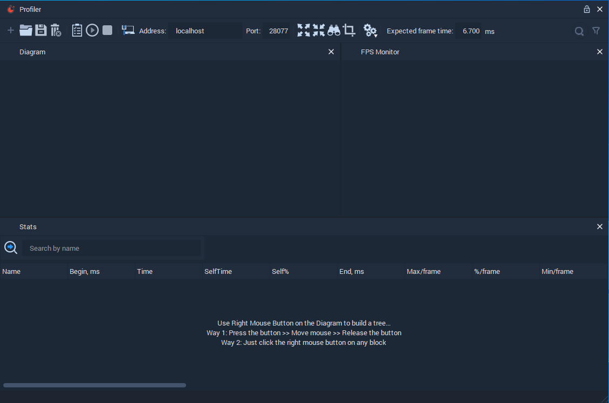
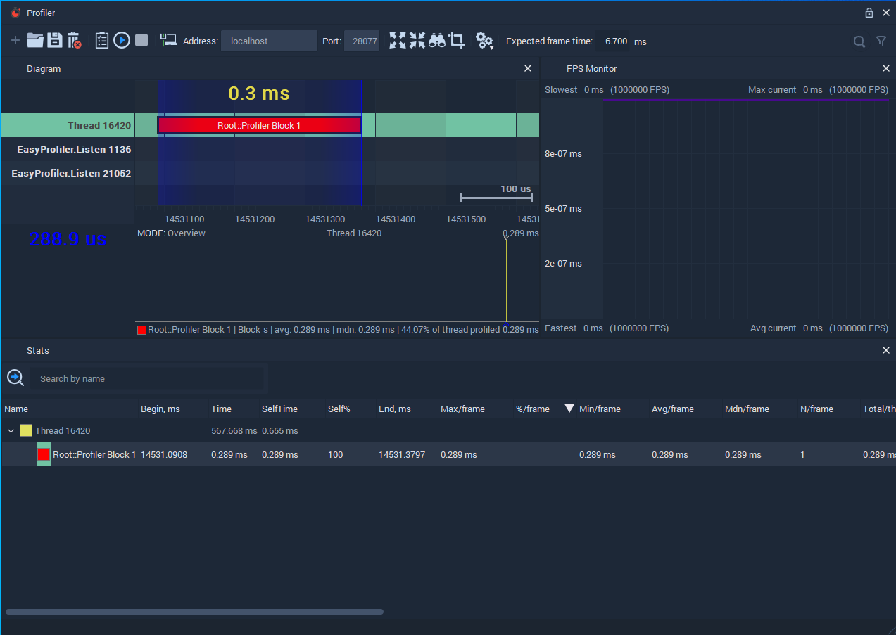
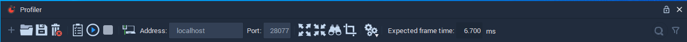
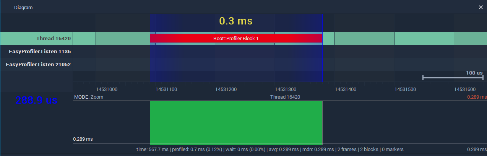
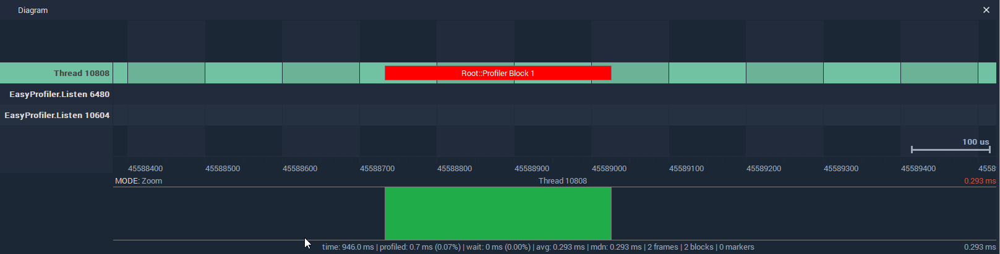
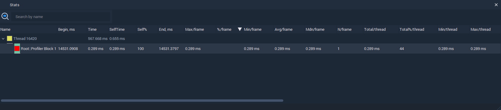
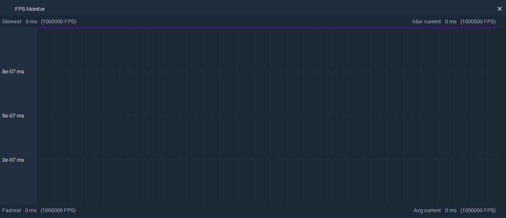

# Profiler View

## Overview

The **Profiler** allows the user to analyze the performance of blocks of **Nodes** in the **Logic**, which we call **Profiler Blocks**. These **Profiler Blocks** have to be set in the **Logic Editor** by using the **Profiler Start** and **Profiler Stop** **Nodes**.

For capturing with the **Profiler**, the **Project** simulation must be playing and the **Profiler** has to be connected with it via the port that has been set in the **Project Settings**.

Once the **Profiler** is connected, it allows the user to start and stop capturing with the buttons on the **Form** toolbar. After a capture has ended, its timeline is shown on the **Diagram** and there the **Profiler Blocks** can be selected. Their data will then appear on the **Stats** panel.

The **Profiler** window consists of four panels \(**Form**, **Diagram**, **Stats**, **FPS Monitor**\), which are explained in detail below. These panels can be shown or hidden by right-clicking on the top bar of any of them and selecting or deselecting them from the drop-down Menu that appears.

## Form

The **Form** toolbar has buttons for configuring the connection of the **Profiler**, starting, stopping, and saving a capture, and customizing the view of the rest of the panels.

## Diagram

The **Diagram** shows the timeline with the capture. It is possible to zoom in and out by scrolling and to move through the timeline by clicking and dragging.

To select a **Block** or a time range to learn its statistics, use the right-click button. For a time range, right-click somewhere in the timeline and drag over the desired range.

After a selection has been made, the statistics of the included **Blocks** appear in the **Stats** panel.

## Stats

The **Stats** panel shows the data collected for the blocks selected in the **Diagram**.

Right-clicking on a block opens a drop-down menu with the viewing options, including `Select Columns`, which allows the user to select which columns are shown on the stats table.

## FPS Monitor

The **FPS Monitor** shows the frame rate of the player in real time when the **Profiler** is connected.

## See Also

* [**Logic Editor**](logic-editor.md)
* [**Profiler Start**](../toolbox/development/profiler-start.md)
* [**Profiler Stop**](../toolbox/development/profiler-stop.md)
* [**Project Settings**](project-settings.md#profiler)

## External Links

* [_Profiling \(computer programming\)_](https://en.wikipedia.org/wiki/Profiling_%28computer_programming%29) on Wikipedia.

