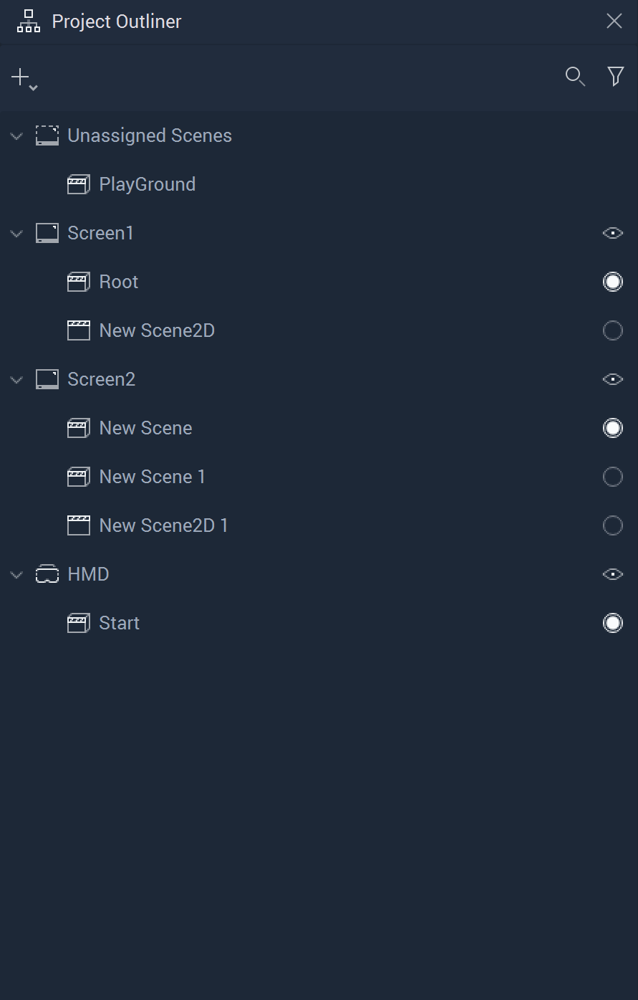
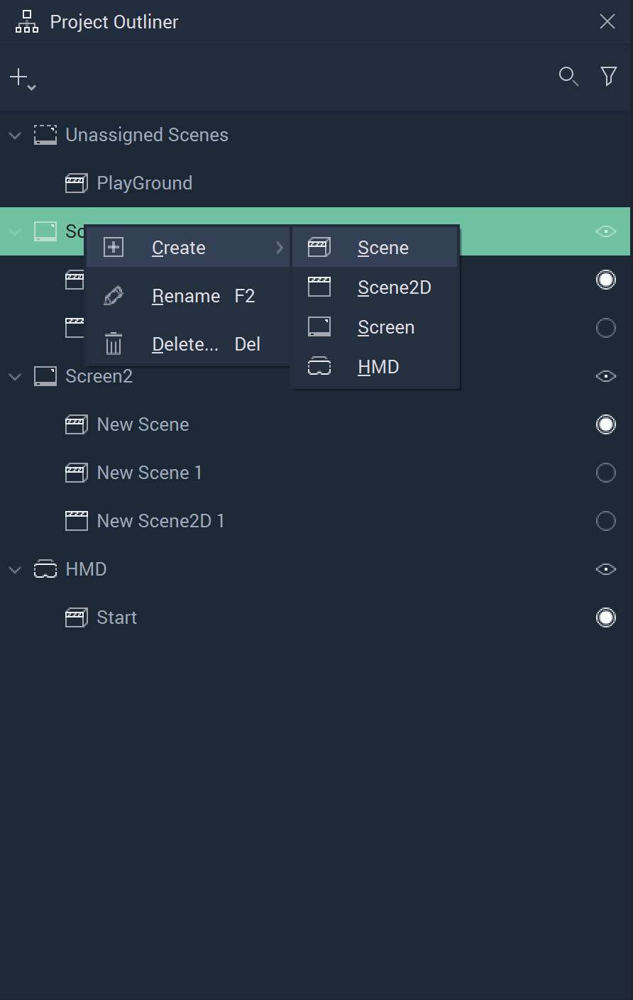
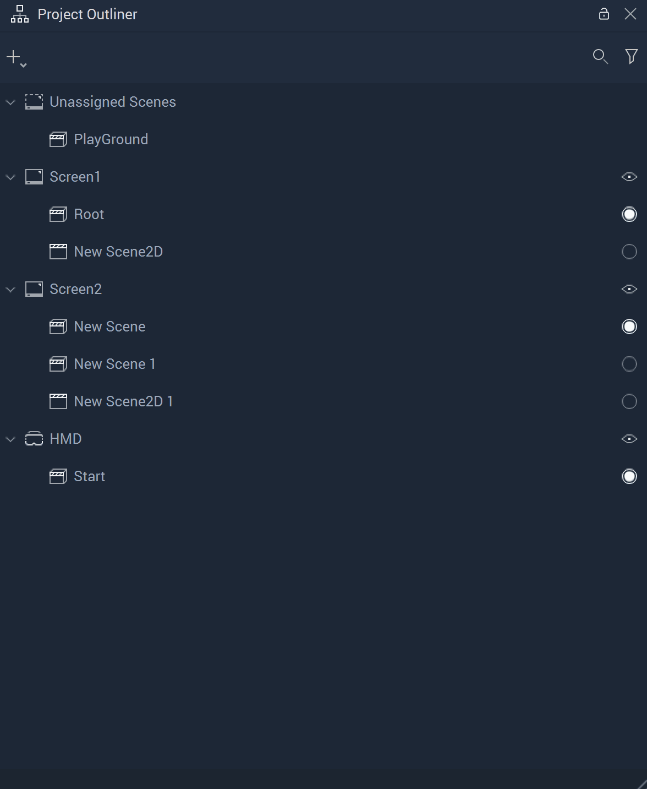
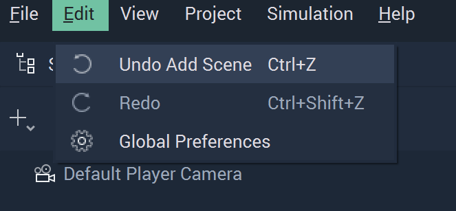
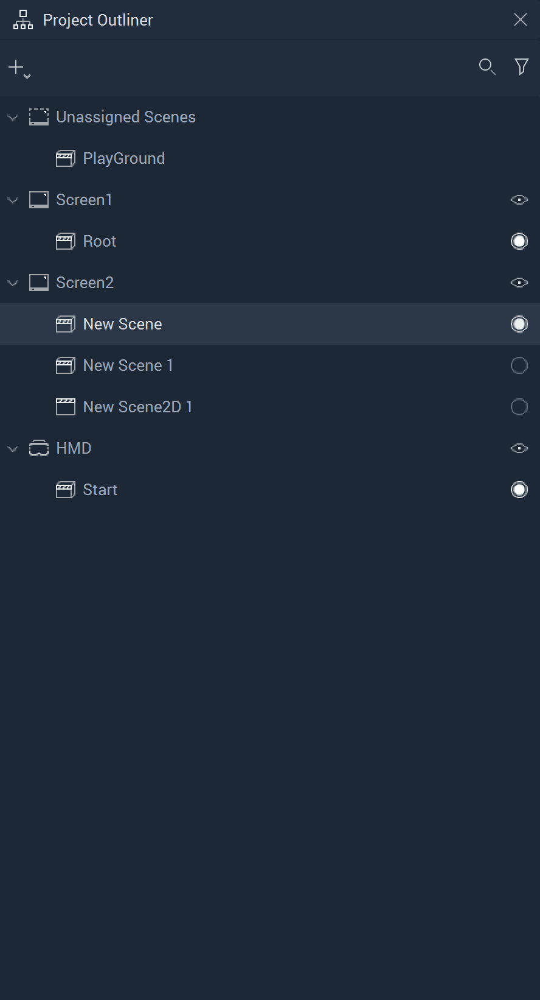
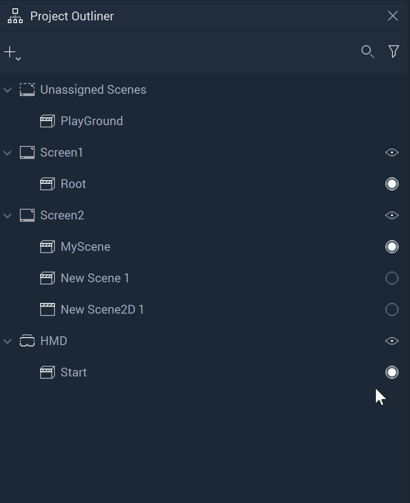
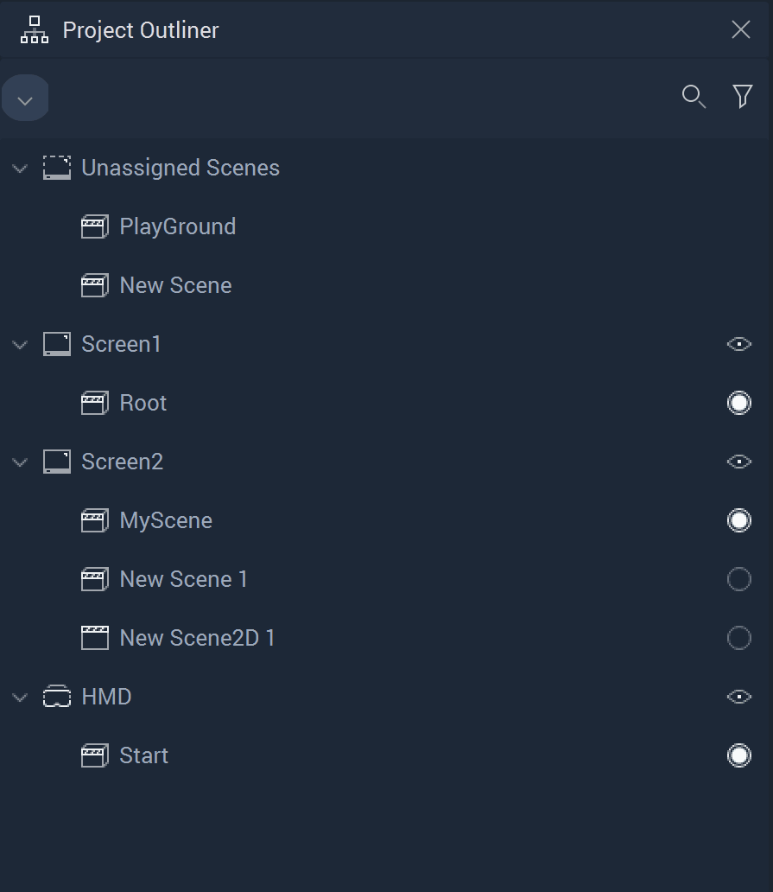

# Project Outliner

## Overview

The **Project Outliner** contains a structured list of every **Scene** and **Screen** in a **Project** and can be used to organize, manage, create, delete, and edit them.

## Creating

New **Screens** and **Scenes** can be created in the following ways:

* Click on the plus  (4) (4) (4) (4) (4) (4) (4) (1) (1) (1) (2) (4).PNG>) icon located at the top left corner of the **Project Outliner**. After that, click the `Scene` button.
* Right-click inside the **Project Outliner** and select `Create` > `Scene` from the pop-up.
* Select `File` > `New Screen` or `New Scene` from the drop-down **Menu**.
* Pressing `Ctrl`+`N` while the **Project Outliner** is active.

## Deleting

**Screens** and **Scenes** can be deleted in the following ways:

* Right-click on an item and select the `Delete` button from the pop-up.
* Select an item and press `del`.

## Undo/Redo

It is also possible to undo and redo an action made in the **Project Outliner**.

* Click `Edit` on the top Menu bar.
* Select `Undo...` or `Redo...` depending on the desired outcome.
* Alternatively, press `Ctrl + Z` to undo an action and `Ctrl + Shift + Z` to redo an action. 

## Renaming

**Screens** and **Scenes** can be renamed by right-clicking an item and selecting `Rename`. You can then type a new name and press **`⏎`**/`Return` to confirm the change.

## Disabling Screens

When you **Start** the **Simulation** of a **Project** in **Incari**, all **Screens** will initialize in separate windows. By disabling a **Scene** in the **Project Outliner**, you can prevent a **Screen** from being included in the **Simulation**.

To disable a **Screen**, simply click the eye (👁) icon.

## Unassigned Scenes

Unless a **Scene** is assigned to a **Screen**, it will appear under `Unassigned Scenes` and will be excluded from the **Simulation**. When a **Scene** is created it is unassigned by default -- unless a **Screen** was selected when it was created, then it will be assigned to that **Screen**.

## Rearranging Scenes

**Scenes** can be rearranged easily by dragging and dropping them to a new place in the **Project Outliner**. Not only does this make it easier to organize **Scenes**, but you can also move them to an entirely different **Screen** or disable them completely by moving them into `Unassigned Scenes`.

## See Also

* [**Scene**](../objects-and-types/project-objects/scene.md)
* [**Screen**](../objects-and-types/project-objects/screen.md)
