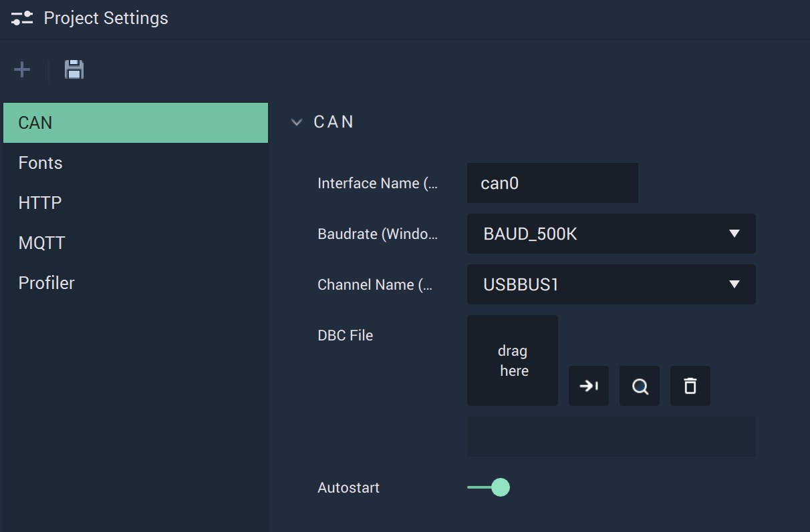
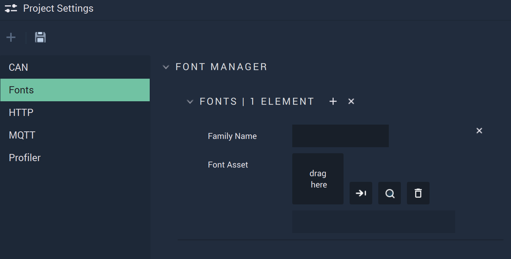
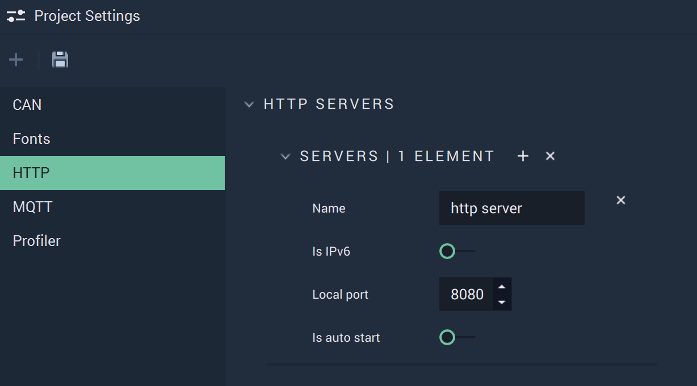
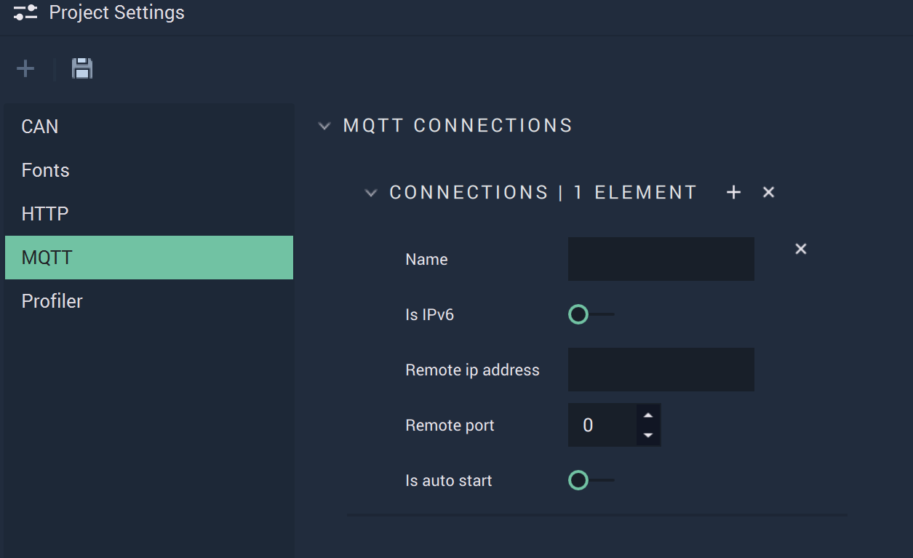

# Project Settings

## Overview

The **Project Settings Module** is used to set up **Projects** that involve the different methods of **Communication** available in **Incari** or **Fonts**.

## CAN

The **CAN Attributes** cover the necessary data to provide functionality to the **CAN Nodes**.

`Interface Name` is the identifying name of the _CAN_ Bus. _Virtual CAN_ is also possible within **Incari**.

`Baudrate` is the speed of the communication for the channel. More information about this metric can be found in the `External Links` section.

`Channel Name` is the USB port that _CAN_ is connected to on _Windows_.

A `DBC File` needs to be uploaded and selected. This `DBC File` is a vital part of the **CAN** protocol, as it stores all data regarding the connections between devices.

`Autostart` can be enabled or disabled and dictates when the channel is run \(from the beginning of an application's life cycle or when the appropriate **Nodes** are used\).

## Fonts

The **Fonts Attributes** let the user upload different types of **Fonts** to add personalized style to texts.

`Family Name` is automatically filled in with the **Font's** name when a **Font** file is chosen. The text can also be edited manually.

`Font Asset` is the **Font** file that is uploaded and selected for use. The **Font** file needs to be in the **Project's** **Asset Folder**.

## HTTP

The **HTTP Attributes** cover the necessary data to provide functionality to the **HTTP Nodes**.

`Name` is an identifying name of a _HTTP_ server chosen at the user's discretion. This will show up in the **Nodes** as a choice for the `Configuration` **Attribute**.

`Is IPv6` can be enabled or disabled. _IPv6_ is the newest version of the _Internet Protocol_. More information about _IPv6_ can be found in the **External Links** section.

`Local port` is the port that the user wants to use for their _HTTP_ server. More information on ports and port forwarding can be found in the **External Links** section.

`Is auto start` can be enabled or disabled and dictates when the server is run \(from the beginning of an application's life cycle or when the appropriate **Nodes** are used\).

## MQTT

The **MQTT Attributes** cover the necessary data to provide functionality to the **MQTT Nodes**.

`Name` is an identifying name of an _MQTT_ connection chosen at the user's discretion.

`Is IPv6` can be enabled or disabled. _IPv6_ is the newest version of the _Internet Protocol_. More information about _IPv6_ can be found in the **External Links** section.

`Remote ip address` is the IP address from which the connection originates.

`Remote port` is the port number of the connection.

`Is auto start` can be enabled or disabled and dictates when the connection is run \(from the beginning of an application's life cycle or when the appropriate **Nodes** are used\).

## See Also

* [**Communication Nodes**](../toolbox/communication/)

## External Links

* More information on the [_Baud metric_](https://en.wikipedia.org/wiki/Baud).
* More information on [_IPv6_](https://en.wikipedia.org/wiki/IPv6).
* More information on [_ports_](https://en.wikipedia.org/wiki/Port_%28computer_networking%29).
* More information on [_port forwarding_](https://en.wikipedia.org/wiki/Port_forwarding).

