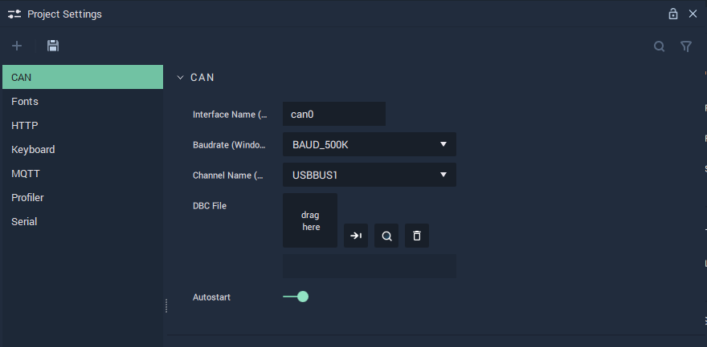

# Project Settings

## Overview

The **Project Settings Module** is used to choose and customize settings for different functionalities within **Incari**, such as **Communications**, the **Profiler Module**, *fonts*, or *layouts* for **On-Screen Keyboards**.

## CAN

The **CAN Settings** cover the necessary data to provide functionality to the **CAN Nodes**.

`Interface Name` is the identifying name of the _CAN_ Bus. _Virtual CAN_ is also possible within **Incari**.

`Baudrate` is the speed of the communication for the channel. More information about this metric can be found in the **External Links** section.

`Channel Name` is the USB port that _CAN_ is connected to on _Windows_.

A `DBC File` needs to be uploaded and selected. This `DBC File` is a vital part of the **CAN** protocol, as it stores all data regarding the connections between devices.

`Autostart` can be enabled or disabled and dictates when the channel is run \(from the beginning of an application's life cycle or when the appropriate **Nodes** are used\).

## Fonts

The **Fonts Settings** let the user define different types of *fonts* to add personalized style to texts.

In the **Font Manager**, the user can manage their *fonts*: using the `+` button to add a new one and the `x` to delete all existing *fonts*. Furthermore, each *font* can be individually deleted with the `x` button next to it.

`Family Name` is automatically filled in with the **Font's** name when a **Font** file is chosen. The text can also be edited manually.

`Font Asset` is the **Font** file that is uploaded and selected for use. The **Font** file needs to be in the **Project's** **Asset Folder**.

## HTTP

The **HTTP Settings** cover the necessary data to provide functionality to the **HTTP Nodes**.

`Name` is an identifying name of a _HTTP_ server chosen at the user's discretion. This will show up in the **Nodes** as a choice for the `Configuration` **Attribute**.

`Is IPv6` can be enabled or disabled. _IPv6_ is the newest version of the _Internet Protocol_. More information about _IPv6_ can be found in the **External Links** section.

`Local port` is the port that the user wants to use for their _HTTP_ server. More information on ports and port forwarding can be found in the **External Links** section.

`Is auto start` can be enabled or disabled and dictates when the server is run \(from the beginning of an application's life cycle or when the appropriate **Nodes** are used\).

## Keyboard

The **Keyboard Settings** let the user define new *layouts* that can then be used for **On-Screen Keyboards**.

In the **Layout Manager**, the user can manage all their custom *layouts*: using the `+` button to add a new one and the `x` to delete all existing custom *layouts*. Furthermore, each *layout* can be individually deleted with the `x` button next to it.

To create a new *layout*, a **Keyboard Layout** **Asset** is necessary. One can be created either in the **Asset Manager** or directly in the **Layout Manager** by clicking on the `Layout Asset` slot. The default for a newly created **Keyboard Layout** **Asset** is the English keyboard, which can be further modified in the **Code Editor**.

The `Layout Name` is also defined in the **Layout Manager**. This is the name with which custom *layouts* defined in the **Layout Manager** will appear in the `Layout` **Attribute** for **On-Screen Keyboards**.

## MQTT

The **MQTT Settings** allow to manage the **MQTT Connections** and cover the necessary data to provide functionality to the **MQTT Nodes**.

`Name` is an identifying name of an _MQTT_ connection chosen at the user's discretion.

`Is IPv6` can be enabled or disabled. _IPv6_ is the newest version of the _Internet Protocol_. More information about _IPv6_ can be found in the **External Links** section.

`Remote ip address` is the IP address from which the connection originates.

`Remote port` is the port number of the connection.

`Is auto start` can be enabled or disabled and dictates when the connection is run \(from the beginning of an application's life cycle or when the appropriate **Nodes** are used\).

## Profiler

The **Profiler Settings** cover the necessary data to provide functionality to the **Profiler** **Module**.

`Enable` enables or disables the **Profiler**, which can be edited in the **Profiler View Module**.

`Port` is the port number to which the **Profiler Module** has to connect.

## Serial

The **Serial Settings** allow to manage the **Serial Connections** and cover the necessary data to provide functionality to the **Serial** **Nodes**.

`Name` is an identifying name of a _Serial_ connection chosen at the user's discretion.

`ChannelName (Linux)` is the USB port that a _Serial_ set-up is connected to on _Linux_. 

`ChannelName (Windows)` is the USB port that a _Serial_ set-up is connected to on _Windows_.

Furthermore, the `ChannelNames` can both be specified, in the case that the user's platform is different than the target platform. If there is no difference in platforms, only one `ChannelName` needs to be filled in. 

`Baudrate` is the speed of the communication for a channel. More information about this metric can be found in the **External Links** section.

## See Also

* [**Communication Nodes**](../toolbox/communication/)
* [**Profiler View**](profiler-view.md)

## External Links

* More information on the [_Baud metric_](https://en.wikipedia.org/wiki/Baud).
* More information on [_IPv6_](https://en.wikipedia.org/wiki/IPv6).
* More information on [_ports_](https://en.wikipedia.org/wiki/Port_%28computer_networking%29).
* More information on [_port forwarding_](https://en.wikipedia.org/wiki/Port_forwarding).

