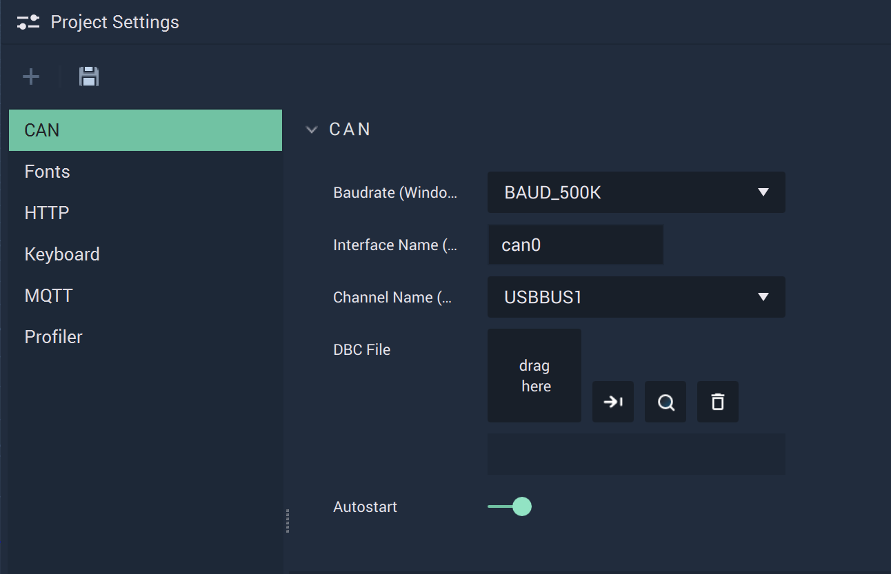
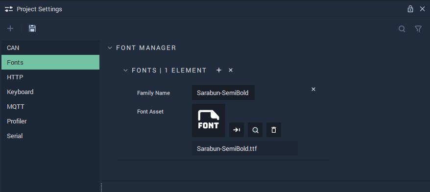
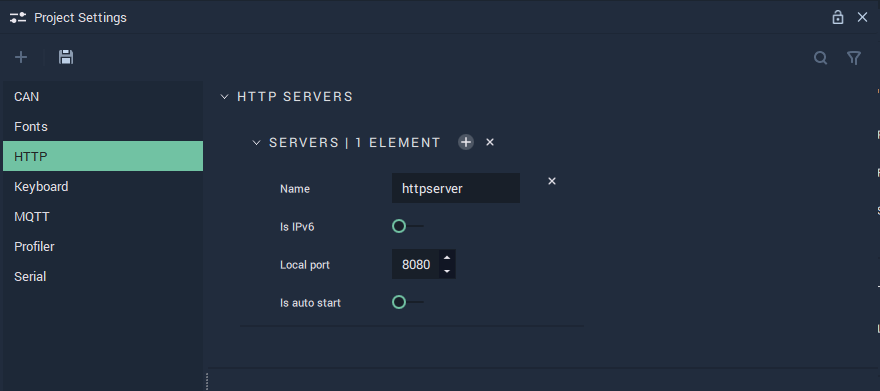
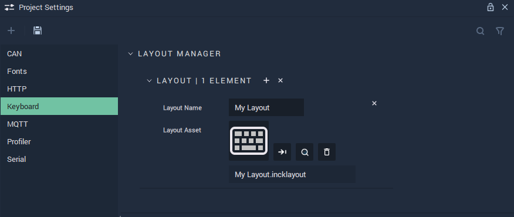
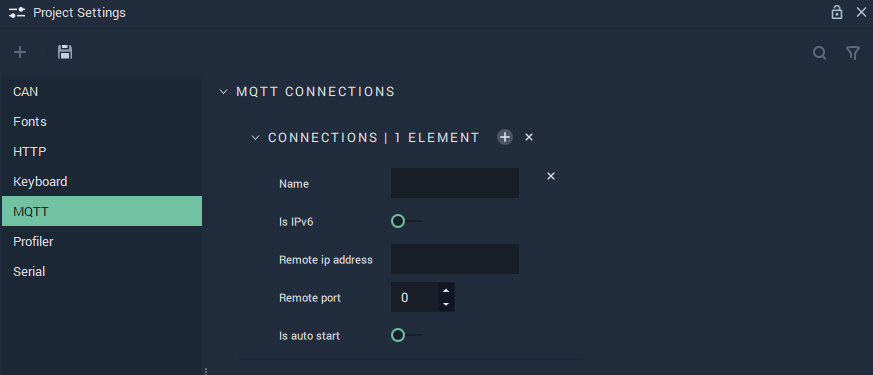
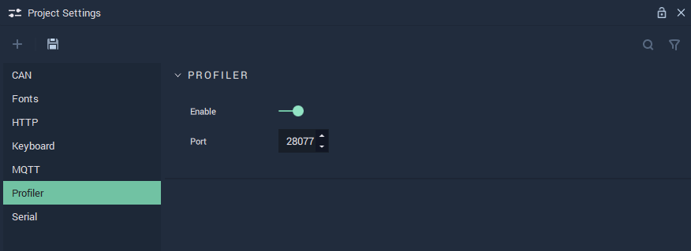
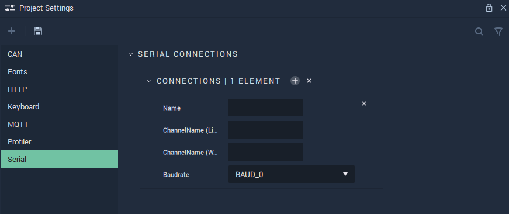

# Project Settings

## Overview

The **Project Settings Module** is used to choose and customize settings for different functionalities within **Incari**, such as **Communications**, the **Profiler Module**, _fonts_, or _layouts_ for **On-Screen Keyboards**.



### CAN

The **CAN Settings** cover the necessary data to provide functionality to the **CAN Nodes**.

`Baudrate (Windows - PCAN)` is the speed of the communication for the channel. More information about this metric can be found in the **External Links** section.

`Interface Name (Linux - SocketCAN)` is the identifying name of the _CAN_ Bus. _Virtual CAN_ is also possible within **Incari**. This is only used for Linux.

`Channel Name (Windows - PCAN)` is the USB port that _CAN_ is connected to on _Windows_.

Furthermore, the `ChannelName` and `Interface Name` can both be specified, in the case that the user's platform is different than the target platform. If there is no difference in platforms, only one needs to be filled in.

A `DBC File` needs to be uploaded and selected. This `DBC File` is a vital part of the **CAN** protocol, as it stores all data regarding the connections between devices.

`Autostart` can be enabled or disabled and dictates when the channel is run (from the beginning of an application's life cycle or when the appropriate **Nodes** are used).



### Fonts

The **Fonts Settings** let the user define different types of _fonts_ to add personalized style to texts.

In the **Font Manager**, the user can manage their _fonts_: using the `+` button to add a new one and the `x` to delete all existing _fonts_. Furthermore, each _font_ can be individually deleted with the `x` button next to it.

`Family Name` is automatically filled in with the **Font's** name when a **Font** file is chosen. The text can also be edited manually.

`Font Asset` is the **Font** file that is uploaded and selected for use. The **Font** file needs to be in the **Project's** **Asset Folder**.



### HTTP

The **HTTP Settings** cover the necessary data to provide functionality to the **HTTP Nodes**.

`Name` is an identifying name of a _HTTP_ server chosen at the user's discretion. This will show up in the **Nodes** as a choice for the `Configuration` **Attribute**.

`Is IPv6` can be enabled or disabled. _IPv6_ is the newest version of the _Internet Protocol_. More information about _IPv6_ can be found in the **External Links** section.

`Local port` is the port the user chooses to use for their _HTTP_ server. For _HTTP_, the standard is 80 or 8080 and for *HTTPS*, the standard is 443. More information on ports and port forwarding can be found in the **External Links** section.

`Is auto start` can be enabled or disabled and dictates when the server is run (from the beginning of an application's life cycle or when the appropriate **Nodes** are used).



### Keyboard

The **Keyboard Settings** let the user define new _layouts_ that can then be used for **On-Screen Keyboards**.

In the **Layout Manager**, the user can manage all their custom _layouts_: using the `+` button to add a new one and the `x` to delete all existing custom _layouts_. Furthermore, each _layout_ can be individually deleted with the `x` button next to it.

To create a new _layout_, a **Keyboard Layout** **Asset** is necessary. One can be created either in the **Asset Manager** or directly in the **Layout Manager** by clicking on the `Layout Asset` slot. The default for a newly created **Keyboard Layout** **Asset** is the English keyboard, which can be further modified in the **Code Editor**.

The `Layout Name` is also defined in the **Layout Manager**. This is the name with which custom _layouts_ defined in the **Layout Manager** will appear in the `Layout` **Attribute** for **On-Screen Keyboards**.



### MQTT

The **MQTT Settings** allow to manage the **MQTT Connections** and cover the necessary data to provide functionality to the **MQTT Nodes**.

`Name` is an identifying name of an _MQTT_ connection chosen at the user's discretion.

`Is IPv6` can be enabled or disabled. _IPv6_ is the newest version of the _Internet Protocol_. More information about _IPv6_ can be found in the **External Links** section.

`Remote ip address` is the IP address from which the connection originates.

`Remote port` is the port number of the connection. For *MQTT*, the standard is 1883.

`Is auto start` can be enabled or disabled and dictates when the connection is run (from the beginning of an application's life cycle or when the appropriate **Nodes** are used).



### Profiler

The **Profiler Settings** cover the necessary data to provide functionality to the **Profiler** **Module**.

`Enable` enables or disables the **Profiler**, which can be edited in the **Profiler View Module**.

`Port` is the port number to which the **Profiler Module** has to connect.



### Serial

The **Serial Settings** allow the user to manage the **Serial Connections** and cover the necessary data to provide functionality to the **Serial** **Nodes**.

**Serial Communication** in **Incari** is available as a plugin and is enabled as default. However, in the case that it is disabled in the **Plugins Editor**, it will not appear in the **Project Settings**. Please refer to the [**Plugins Editor**](../../../modules/plugins-editor.md) to find out more information.

`Name` is an identifying name of a _Serial_ connection chosen at the user's discretion.

`ChannelName (Linux)` is the serial or USB port that a _Serial_ set-up is connected to on _Linux_. Naming conventions for serial ports in *Linux* look like: /dev/ttyUSB0, /dev/ttyS0, /dev/ttyS1, etc.

`ChannelName (Windows)` is the serial or USB port that a _Serial_ set-up is connected to on _Windows_. In *Windows*, serial ports are known as *COM* ports. Naming convention for *COM* ports in *Windows* look like: COM1, COM2, COM3, etc. 

Furthermore, the `ChannelNames` can both be specified, in the case that the user's platform is different than the target platform. If there is no difference in platforms, only one `ChannelName` needs to be filled in.

`Baudrate` is the speed of the communication for a channel. More information about this metric can be found in the **External Links**
 section. 



## See Also

* [**Communication Nodes**](../toolbox/communication/)
* [**Profiler View**](profiler-view.md)

## External Links

* More information on the [_Baud metric_](https://en.wikipedia.org/wiki/Baud).
* More information on [_IPv6_](https://en.wikipedia.org/wiki/IPv6).
* More information on [_ports_](https://en.wikipedia.org/wiki/Port\_\(computer\_networking\)).
* More information on [_port forwarding_](https://en.wikipedia.org/wiki/Port\_forwarding).
