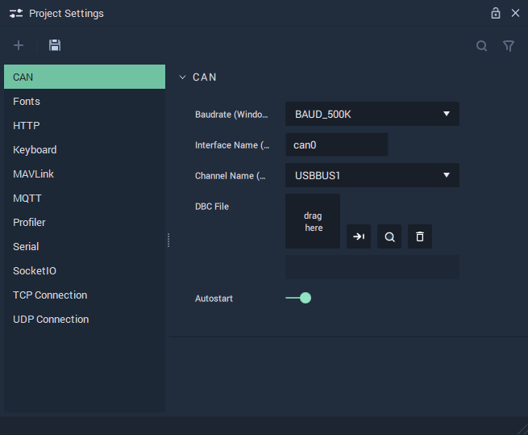

# CAN

The **CAN Settings** cover the necessary data to provide functionality to the [**CAN Nodes**](../../toolbox/communication/can/README.md).

`Baudrate (Windows - PCAN)` is the speed of the communication for the channel. More information about this metric can be found in the **External Links** section.

`Interface Name (Linux - SocketCAN)` is the identifying name of the _CAN_ Bus. _Virtual CAN_ is also possible within **Incari**. This is only used for Linux.

`Channel Name (Windows - PCAN)` is the USB port that _CAN_ is connected to on _Windows_.

Furthermore, the `ChannelName` and `Interface Name` can both be specified, in the case that the user's platform is different than the target platform. If there is no difference in platforms, only one needs to be filled in.

A `DBC File` needs to be uploaded and selected. This `DBC File` is a vital part of the **CAN** protocol, as it stores all data regarding the connections between devices.

`Autostart` can be enabled or disabled and dictates when the channel is run (from the beginning of an application's life cycle or when the appropriate **Nodes** are used).

## See Also

* [**CAN Nodes**](../toolbox/communication/can/)

## External Links

* More information on the [_Baud metric_](https://en.wikipedia.org/wiki/Baud).