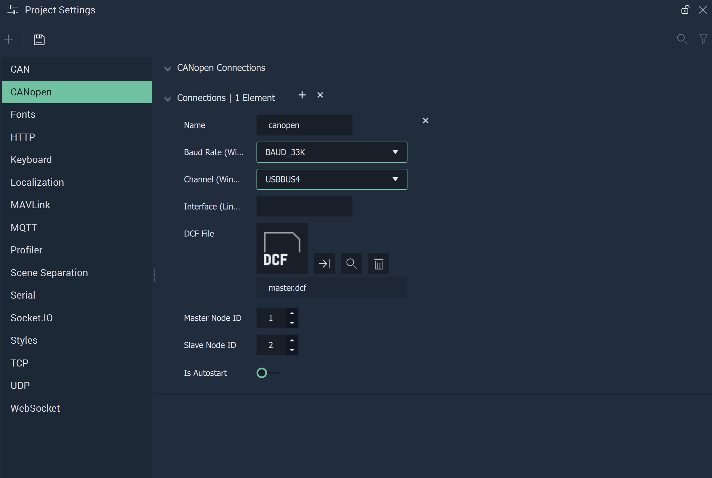

# CANopen

The **CANopen Settings** cover the necessary data to provide functionality to the [**CANopen Nodes**](../../toolbox/communication/canopen/README.md).

`Name` is an identifying name chosen at the user's discretion. This will show up in the **Nodes** as a choice for the `Configuration` **Attribute**.

`Baud Rate (Windows - PCAN)` is the speed of the communication for the channel. More information about this metric can be found in the **External Links** section.

`Channel (Windows - PCAN)` is the USB port that _CANopen_ is connected to on _Windows_.

`Interface (Linux - SocketCAN)` is the identifying name of the _CANopen_ Bus. 

Furthermore, the `Channel` and `Interface` can both be specified, in the case that the user's platform is different than the target platform. If there is no difference in platforms, only one needs to be filled in.

A `DCF File` needs to be uploaded and selected. This `DCF File` is a vital part of the **CANopen** protocol, as it stores all data regarding the connections between devices in an object dictionary.

`Master Node ID` is the ID of the node **Incari** represents. 

`Slave Node ID` is the ID of the node that **Incari** connects to. 

`Is Autostart` can be enabled or disabled and dictates when the channel is run (from the beginning of an application's life cycle or when the appropriate **Nodes** are used).

## See Also

* [**CANopen Nodes**](../../toolbox/communication/canopen/README.md)

## External Links

* More information on the [_Baud metric_](https://en.wikipedia.org/wiki/Baud).