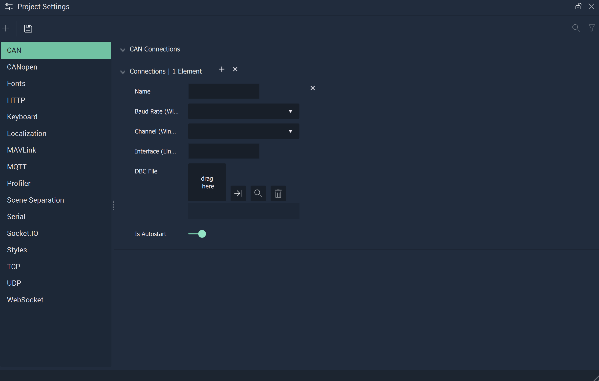

# Project Settings

The **Project Settings Module** is used to choose and customize settings for different functionalities within **Incari**, such as **Communications**, the **Profiler Module**, _fonts_, or _layouts_ for **On-Screen Keyboards**.

* [**CAN**](CAN.md)
* [**CANopen**](CANopen.md)
* [**Fonts**](fonts.md)
* [**HTTP**](http.md)
* [**Keyboard**](keyboard.md)
* [**Localization**](localization.md)
* [**MAVLink**](mavlink.md)
* [**MQTT**](mqtt.md)
* [**Profiler**](profiler.md)
* [**Scene Separation**](sceneseparation.md)
* [**Serial**](serial.md)
* [**Socket.IO**](socketio.md)
* [**Styles**](style.md)
* [**TCP**](tcp-connection.md)
* [**UDP**](udp-connection.md)
* [**WebSocket**](websocket.md)

