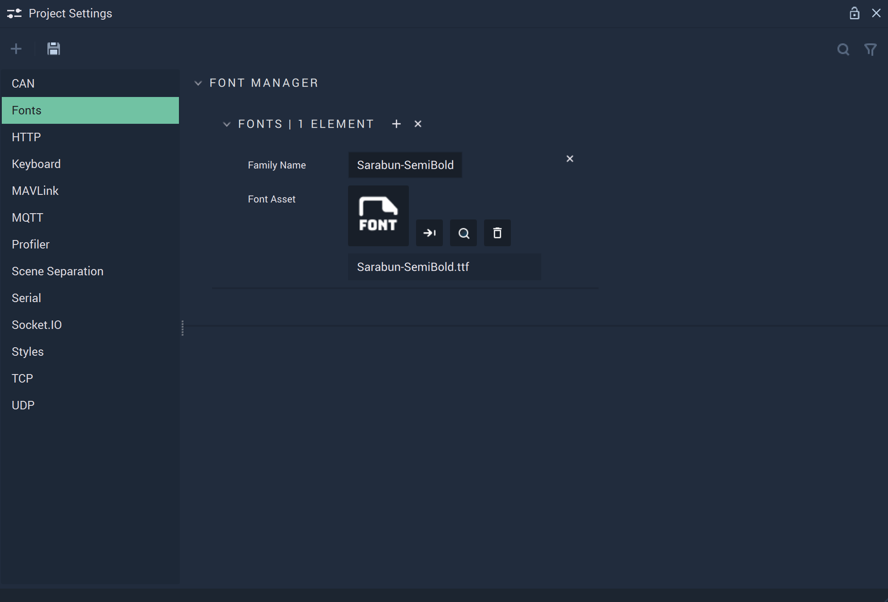

# Fonts

The **Fonts Settings** let the user define different types of _fonts_ to add personalized style to texts.

In the **Font Manager**, the user can manage their _fonts_: using the `+` button to add a new one and the `x` to delete all existing _fonts_. Furthermore, each _font_ can be individually deleted with the `x` button next to it.

`Family Name` is automatically filled in with the **Font's** name when a **Font** file is chosen. The text can also be edited manually.

`Font Asset` is the **Font** file that is uploaded and selected for use. The **Font** file needs to be in the **Project's** **Asset Folder**.

