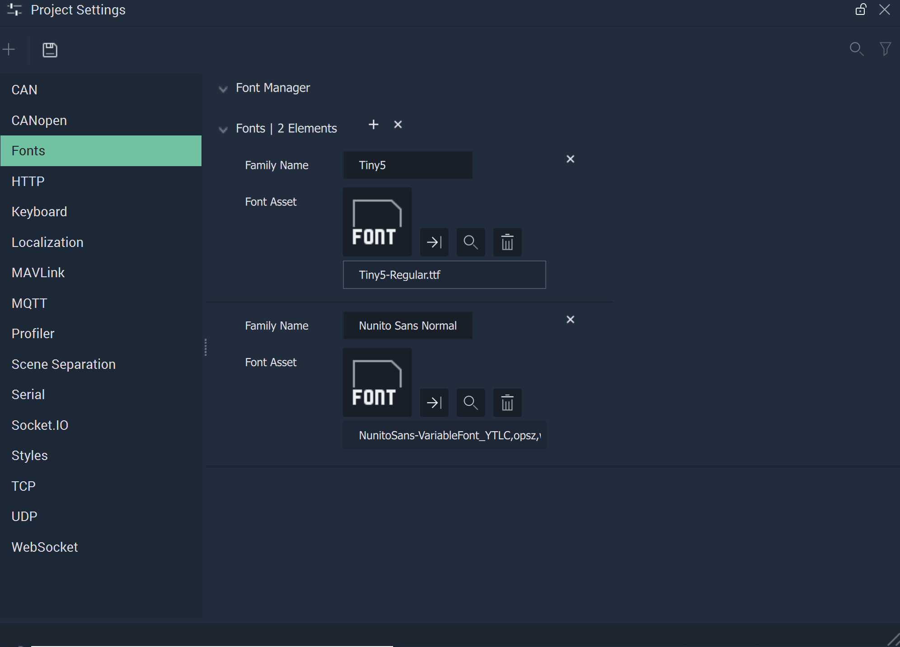

# Fonts

The **Fonts Settings** let the user define different types of _fonts_ to add personalized style to texts.

In the **Font Manager**, the user can manage their _fonts_: using the `+` button to add a new one and the `x` to delete all existing _fonts_. Furthermore, each _font_ can be individually deleted with the `x` button next to it.

`Family Name` is automatically filled in with the **Font's** name when a **Font** file is chosen. The text can also be edited manually.

`Font Asset` is the **Font** file that is uploaded and selected for use. The **Font** file needs to be in the **Project's** **Asset Folder**.

## Variable Fonts

**Incari** is capable of supporting *variable fonts*, which allows the user to access different varieties of a font from one font file. More information can be found [here](https://fonts.google.com/knowledge/introducing_type/introducing_variable_fonts).

Certain **Objects** can handle *variable fonts*. In **Scene2Ds**, these are [**Buttons**](../../objects-and-types/scene2d-objects/gui/button.md), [**Dropdowns**](../../objects-and-types/scene2d-objects/gui/dropdown.md), [**Lists**](../../objects-and-types/scene2d-objects/gui/list.md), [**Texts**](../../objects-and-types/scene2d-objects/figma/figmatext.md), [**Text Areas**](../../objects-and-types/scene2d-objects/gui/textarea.md), and[**Text Inputs**](../../objects-and-types/scene2d-objects/gui/textinput.md). In **Scenes**, these are [**Labels**](../../objects-and-types/scene-objects/3dobjects/label.md), [**Lists**](../../objects-and-types/scene-objects/3dobjects/list.md), [**On-Screen Keyboards**](../../objects-and-types/scene-objects/3dobjects/onscreenkeyboard.md), and [**Texts**](../../objects-and-types/scene-objects/3dobjects/text.md).

However, only a handful of the **Objects** are currently configurable, meaning that the user can edit specific aspects of the **Font** within **Incari** by way of the **Object's** `Font` **Attributes**. These configurable **Objects** are **Texts** in **Scene2Ds** and all the aformentioned **Objects** in **Scenes**. 

As of 2024.1, default fonts from older **Projects** are added to the `Asset/2023.2` directory. 