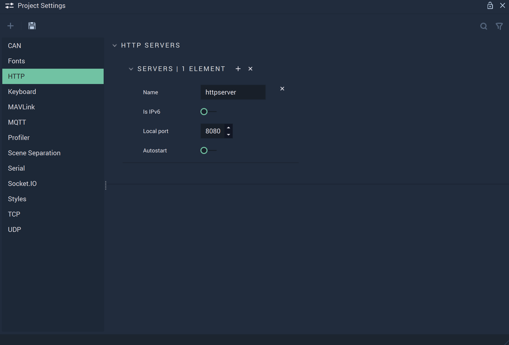

# HTTP

The **HTTP Settings** cover the necessary data to provide functionality to the [**HTTP Nodes**](../../toolbox/communication/http/README.md).

`Name` is an identifying name of a _HTTP_ server chosen at the user's discretion. This will show up in the **Nodes** as a choice for the `Configuration` **Attribute**.

`Is IPv6` can be enabled or disabled. _IPv6_ is the newest version of the _Internet Protocol_. More information about _IPv6_ can be found in the **External Links** section.

`Local port` is the port the user chooses to use for their _HTTP_ server. For _HTTP_, the standard is 80 or 8080 and for _HTTPS_, the standard is 443. More information on ports and port forwarding can be found in the **External Links** section.

`Autostart` can be enabled or disabled and dictates when the server is run (from the beginning of an application's life cycle or when the appropriate **Nodes** are used).

## See Also

* [**HTTP Nodes**](../../toolbox/communication/http/README.md)

## External Links

* More information on [_IPv6_](https://en.wikipedia.org/wiki/IPv6).
* More information on [_ports_](https://en.wikipedia.org/wiki/Port\_\(computer\_networking\)).
* More information on [_port forwarding_](https://en.wikipedia.org/wiki/Port\_forwarding).
