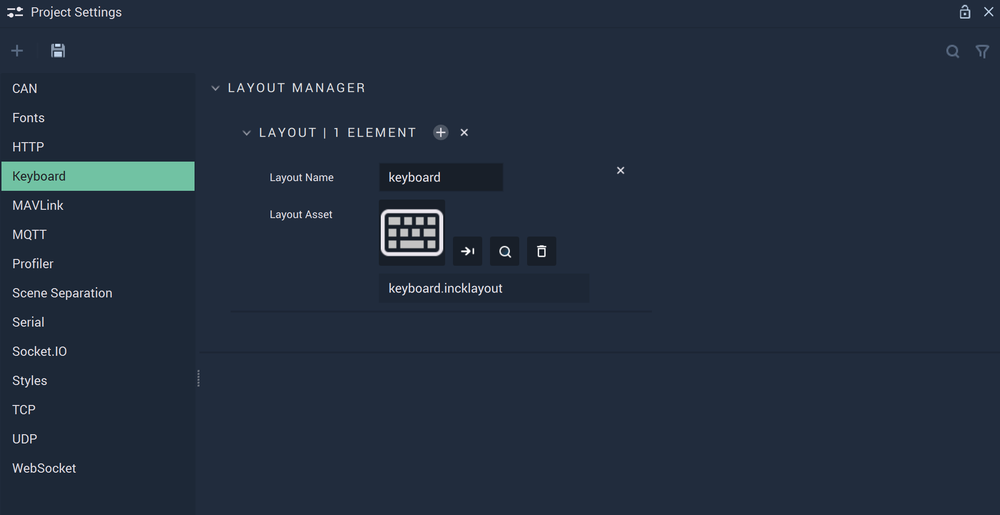

# Keyboard

The **Keyboard Settings** let the user define new _layouts_ that can then be used for **On-Screen Keyboards**.

In the **Layout Manager**, the user can manage all their custom _layouts_: using the `+` button to add a new one and the `x` to delete all existing custom _layouts_. Furthermore, each _layout_ can be individually deleted with the `x` button next to it.

To create a new _layout_, a **Keyboard Layout** **Asset** is necessary. One can be created either in the **Asset Manager** or directly in the **Layout Manager** by clicking on the `Layout Asset` slot. The default for a newly created **Keyboard Layout** **Asset** is the English keyboard, which can be further modified in the **Code Editor**.

The `Layout Name` is also defined in the **Layout Manager**. This is the name with which custom _layouts_ defined in the **Layout Manager** will appear in the `Layout` **Attribute** for **On-Screen Keyboards**.

## See also

* [On-Screen Keyboard](../../objects-and-types/scene-objects/3dobjects/onscreenkeyboard.md)