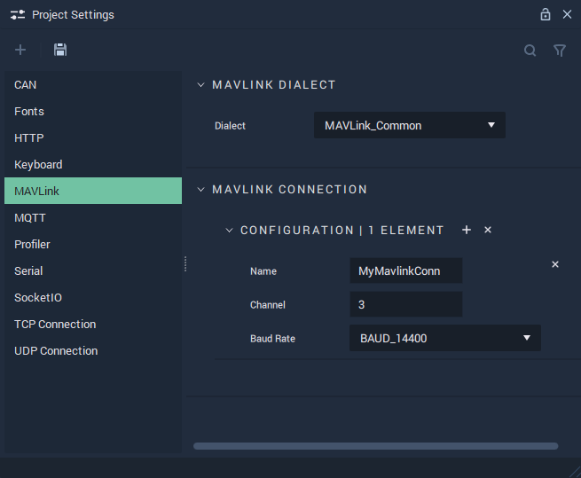

# MAVLink

The **MAVLink Settings** cover the necessary data to provide functionality to the [**MAVLink Nodes**](../../toolbox/communication/mavlink/README.md).

`Dialect` holds the 'rules' and messages of the protocol, in *XML* format. 

`Name` is an identifying name of a _MAVLink_ system chosen at the user's discretion. This will show up in the **Nodes** as a choice for the `Configuration` **Attribute**.

`Channel` is the link ID of a MAVLink packet. 

`Baud Rate` is the speed of the communication for a channel. More information about this metric can be found in the **External Links** section.

## See Also

* [**MAVLink Nodes**](../../toolbox/communication/mavlink/README.md)

## External Links

* More information on the [_Baud metric_](https://en.wikipedia.org/wiki/Baud).