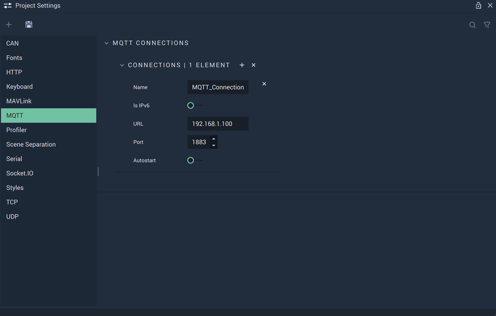

# MQTT

The **MQTT Settings** allow the user to manage the **MQTT Connections** and cover the necessary data to provide functionality to the [**MQTT Nodes**](../../toolbox/communication/mqtt/README.md).

`Name` is an identifying name of an _MQTT_ connection chosen at the user's discretion.

`Is IPv6` can be enabled or disabled. _IPv6_ is the newest version of the _Internet Protocol_. More information about _IPv6_ can be found in the **External Links** section.

`Remote IP address` is the IP address from which the connection originates.

`Remote port` is the port number of the connection. For _MQTT_, the standard is 1883.

`Autostart` can be enabled or disabled and dictates when the connection is run (from the beginning of an application's life cycle or when the appropriate **Nodes** are used).

## See Also

* [**MQTT Nodes**](../../toolbox/communication/mqtt/README.md)

## External Links

* More information on [_IPv6_](https://en.wikipedia.org/wiki/IPv6).
* More information on [_ports_](https://en.wikipedia.org/wiki/Port\_\(computer\_networking\)).
* More information on [_port forwarding_](https://en.wikipedia.org/wiki/Port\_forwarding).
