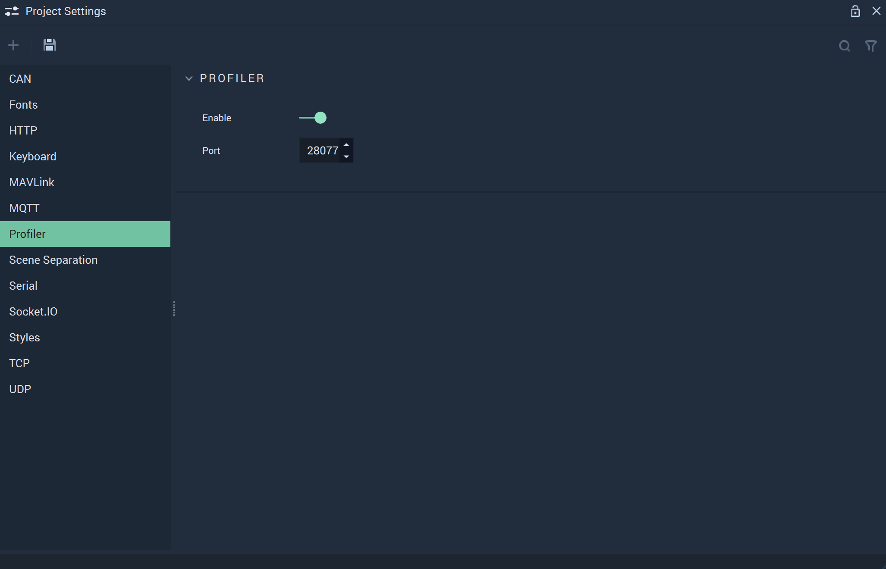

# Profiler

The **Profiler Settings** cover the necessary data to provide functionality to the **Profiler** **Module**.

`Enable` enables or disables the **Profiler**, which can be edited in the **Profiler View Module**.

`Port` is the port number to which the **Profiler Module** has to connect.

## See Also

* [**Profiler View**](../profiler-view.md)