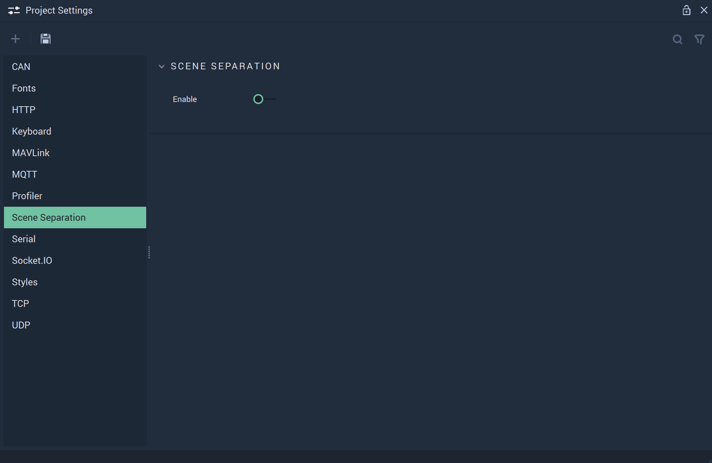

# Scene Separation

The **Scene Separation Settings** in **Incari** streamline what **Scenes** are loaded at runtime. 

`Enable` enables or disables **Scene** separation. This means that when enabled, all **Scenes** are treated individually  **Scenes** are are intialized separately and all **Logic** and graphics associated with a **Scene** not in use will not load or intialize. 

