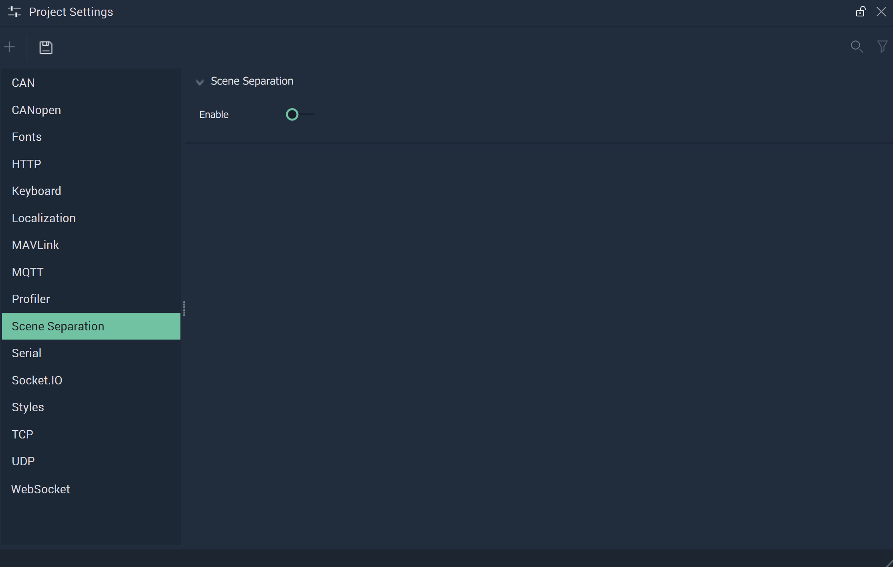

# Scene Separation

The **Scene Separation Settings** in **Incari** streamline what **Scenes** are loaded at runtime. 

`Enable` enables or disables **Scene** separation. This means that when enabled, all **Scenes** are treated individually. **Scenes** are intialized separately and all **Logic** and graphics associated with a **Scene** not in use will not load or intialize. In other words, if this is enabled, there is a shorter loading time.

This can be used in tandem with a few **Nodes** which allow the user to incorporate this function in the **Logic**. These are:

* [**Scene**](../../toolbox/events/scene/README.md)
  * [**On Scene Loaded**](../../toolbox/events/scene/onsceneloaded.md)
* [**Screen**](../../toolbox/incari/screen/README.md)
  * [**Load Scene**](../../toolbox/incari/screen/loadscene.md)
  * [**Unload Scene**](../../toolbox/incari/screen/unloadscene.md)

