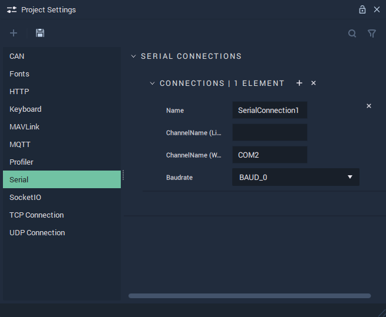

# Serial

The **Serial Settings** allow the user to manage the **Serial Connections** and cover the necessary data to provide functionality to the [**Serial Nodes**](../../toolbox/communication/serial/README.md).

**Serial Communication** in **Incari** is available as a plugin and is enabled as default. However, in the case that it is disabled in the **Plugins Editor**, it will not appear in the **Project Settings**. Please refer to the [**Plugins Editor**](../plugins/communication/README.md) to find out more information.

`Name` is an identifying name of a _Serial_ connection chosen at the user's discretion.

`ChannelName (Linux)` is the serial or USB port that a _Serial_ set-up is connected to on _Linux_. Naming conventions for serial ports in _Linux_ look like: /dev/ttyUSB0, /dev/ttyS0, /dev/ttyS1, etc.

`ChannelName (Windows)` is the serial or USB port that a _Serial_ set-up is connected to on _Windows_. In _Windows_, serial ports are known as _COM_ ports. Naming conventions for _COM_ ports in _Windows_ look like: COM1, COM2, COM3, etc.

Furthermore, the `ChannelNames` can both be specified, in the case that the user's platform is different than the target platform. If there is no difference in platforms, only one `ChannelName` needs to be filled in.

`Baudrate` is the speed of the communication for a channel. More information about this metric can be found in the **External Links** section.

## See Also

* [**Serial Nodes**](../../toolbox/communication/serial/README.md)

## External Links

* More information on the [_Baud metric_](https://en.wikipedia.org/wiki/Baud).