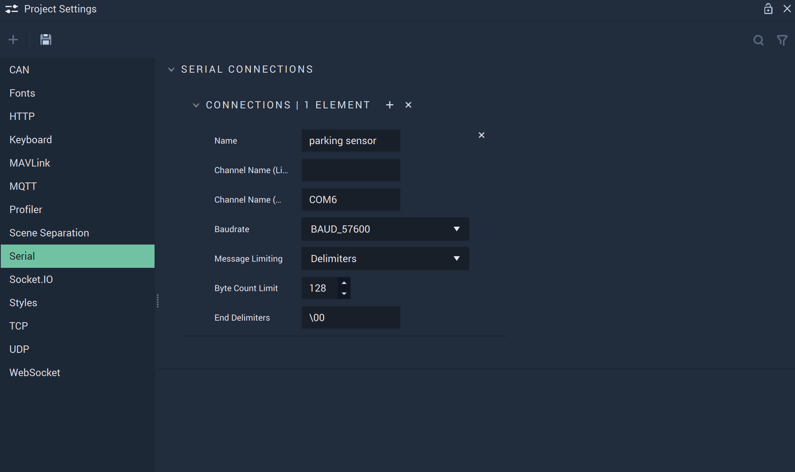

# Serial

The **Serial Settings** allow the user to manage the **Serial Connections** and cover the necessary data to provide functionality to the [**Serial Nodes**](../../toolbox/communication/serial/README.md).

**Serial Communication** in **Incari** is available as a plugin and is enabled as default. However, in the case that it is disabled in the **Plugins Editor**, it will not appear in the **Project Settings**. Please refer to the [**Plugins Editor**](../plugins/communication/README.md) to find out more information.

`Name` is an identifying name of a _Serial_ connection chosen at the user's discretion.

`ChannelName (Linux)` is the serial or USB port that a _Serial_ set-up is connected to on _Linux_. Naming conventions for serial ports in _Linux_ look like: /dev/ttyUSB0, /dev/ttyS0, /dev/ttyS1, etc.

`ChannelName (Windows)` is the serial or USB port that a _Serial_ set-up is connected to on _Windows_. In _Windows_, serial ports are known as _COM_ ports. Naming conventions for _COM_ ports in _Windows_ look like: COM1, COM2, COM3, etc.

Furthermore, the `ChannelNames` can both be specified, in the case that the user's platform is different than the target platform. If there is no difference in platforms, only one `ChannelName` needs to be filled in.

`Baudrate` is the speed of the communication for a channel. More information about this metric can be found in the **External Links** section.

`Message Limiting` determines how *Serial* messages are received and parsed. There are three options:

* `None`: Any incoming data is directly passed to the [**On Serial Packet Receive Node**](../../toolbox/communication/serial/events/onserialpacketreceive.md).

* `ByteCount`: Incoming data is partitioned into messages of a given size which then are individually forwarded to the [**On Serial Packet Receive Node**](../../toolbox/communication/serial/events/onserialpacketreceive.md).

* `Delimiters`: Incoming data is parsed until any of the given symbols are encountered. The message is then forwarded to the [**On Serial Packet Receive Node**](../../toolbox/communication/serial/events/onserialpacketreceive.md). This process repeats until the end of the received data is reached. If the received data exceeds 1024 bytes without a delimiter found, that data is passed whole to the [**On Serial Packet Receive Node**](../../toolbox/communication/serial/events/onserialpacketreceive.md). Please note that the end symbols will not be part of the forwarded message and empty messages will not be forwarded.

`Byte Count Limit` specifies the message size in bytes for the `ByteCount` mode from `Message Limiting`. Currently, only positive values can be handled. 

`End Delimiters`: These specifies the message end symbols for the `Delimiters` mode from `Message Limiting`. Since some symbols are difficult to enter (e.g. newlines), this field parses the following symbols, too:

* “\n” → linefeed

* “\r” → carriage return

* “\t” → tabulator

* “\”” → “

* “'“ → '

* “\\” → \

* “\xx” → the byte representation of some hexadecimal number xx. For example, \00 would become a null byte and \03 would become \<ETX\>. All other symbols will be parsed as the symbol itself. The symbols are checked individually. This means that specified delimiters “\n\03” means that if either a linefeed or \<ETX\> is encountered it will end the message not that these two have to appear in that order. 

## See Also

* [**Serial Nodes**](../../toolbox/communication/serial/README.md)

## External Links

* More information on the [_Baud metric_](https://en.wikipedia.org/wiki/Baud).
* More information on [_control characters_](https://en.wikipedia.org/wiki/Control_character).