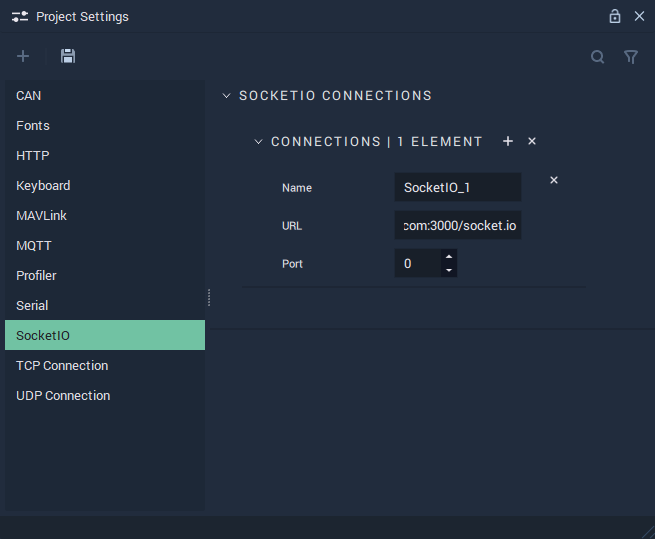

# Socket.IO

The **Socket.IO Settings** allow the user to manage the **Socket.IO Connections** and cover the necessary data to provide functionality to the [**Socket.IO** **Nodes**](../../toolbox/communication/socketio/README.md).

**Socket.IO Communication** in **Incari** is available as a plugin and is enabled as default. However, in the case that it is disabled in the **Plugins Editor**, it will not appear in the **Project Settings**. Please refer to the [**Plugins Editor**](../plugins/communication/README.md) to find out more information.

`Name` is an identifying name of a *Socket.IO* connection chosen at the user's discretion.

`URL` is the *URL* of the server.

`Port` is the port the user chooses to serve the *Socket.IO* connection. This is often the same port as the website, which for _HTTP_ is 80 and for _HTTPS_ is 443.

## See Also

* [**Socket.IO** **Nodes**](../../toolbox/communication/socketio/README.md)

## External Links

* More information on [_ports_](https://en.wikipedia.org/wiki/Port\_\(computer\_networking\)).
* More information on [_port forwarding_](https://en.wikipedia.org/wiki/Port\_forwarding).