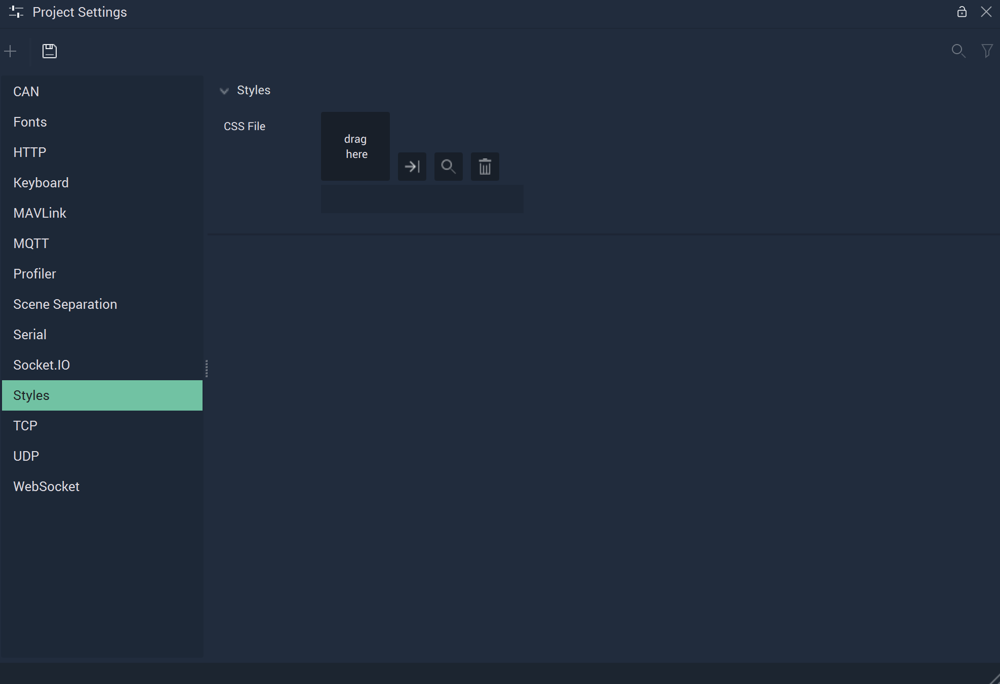

# Styles

The **Styles Settings** allow the user to provide a *CSS* file which applies the specified *CSS* styling over all **Scene2Ds** and the elements in them. This gives more control over things like font, background color, border, etc. 

`CSS File` is the *CSS* file the user chooses, which will provide the desired *CSS* styling for all **Scene2Ds**. 

## See Also

* [**Scene2D**](../../objects-and-types/project-objects/scene2d.md)
* [**Scene2D Objects**](../../objects-and-types/scene2d-objects/)

## External Links

* More on *CSS* styling on [*Wikipedia*](https://en.wikipedia.org/wiki/CSS).