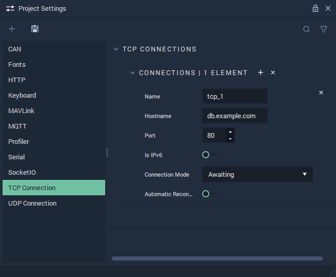

# TCP Connection

The **TCP Connection Settings** allow the user to manage **TCP Connections** and cover the necessary data to provide functionality to the [**TCP** **Nodes**](../../toolbox/communication/tcp/README.md).

**TCP Communication** in **Incari** is available as a plugin and is enabled as default. However, in the case that it is disabled in the **Plugins Editor**, it will not appear in the **Project Settings**. Please refer to the [**Plugins Editor**](../plugins/communication/tcpconnectionsmanager.md) to find out more information.

`Name` is an identifying name of a *TCP* connection chosen at the user's discretion.

`Hostname` is the *TCP* endpoint (either a URL or IP address) and is only relevant when `Connection Mode` is set to `Initiating`. 

`Port` represents two different things depending on the chosen `Connection Mode`. For `Awaiting`, it is the port number being listened to. For _Initiating_, it is the port number the remote device is listening on.

`Is IPv6` can be enabled or disabled. _IPv6_ is the newest version of the _Internet Protocol_. More information about _IPv6_ can be found in the **External Links** section.

`Connection Mode` is the state the connection finds itself in. This is either `Awaiting` (where a local server is started and waits for incoming connections, similar to an *HTTP* server) or `Initiating` (where a connection is initiated to a remote server, similar to functions associated with the **HTTP Client Node**).

`Automatic Reconnect` can be enabled or disabled. It keeps the *TCP* connection open in the case that it has been broken.

## See Also

* [**TCP** **Nodes**](../../toolbox/communication/tcp/README.md)

## External Links

* More information on [_IPv6_](https://en.wikipedia.org/wiki/IPv6).
* More information on [_ports_](https://en.wikipedia.org/wiki/Port\_\(computer\_networking\)).
* More information on [_port forwarding_](https://en.wikipedia.org/wiki/Port\_forwarding).
