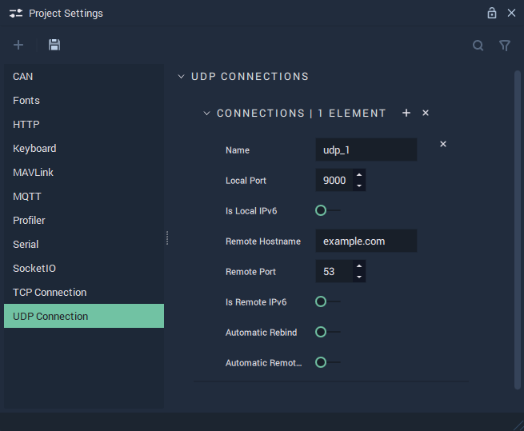

# UDP Connection

The **UDP Connection Settings** allow the user to manage **UDP Connections** and cover the necessary data to provide functionality to the [**UDP** **Nodes**](../../toolbox/communication/udp/README.md). Messages are called *datagrams*.

**UDP Communication** in **Incari** is available as a plugin and is enabled as default. However, in the case that it is disabled in the **Plugins Editor**, it will not appear in the **Project Settings**. Please refer to the [**Plugins Editor**](../plugins/communication/udpconnectionsmanager.md) to find out more information.

`Name` is an identifying name of a *UDP* connection chosen at the user's discretion.

`Local Port` is the port number of the machine listening for *datagrams*.

`Is Local IPv6` can be enabled or disabled and applies only to the local port. _IPv6_ is the newest version of the _Internet Protocol_. More information about _IPv6_ can be found in the **External Links** section.

`Remote Hostname` is the *UDP* endpoint (either a URL or IP address).

`Remote Port` is the port number of the *datagram's* destination.

`Is Remote IPv6` can be enabled or disabled and applies only to the remote port.

`Automatic Rebind` can be enabled or disabled. It automatically restarts the ability to send and receive *datagrams*.

`Automatic Remote IP Address` can be enabled or disabled. It automatically sets the remote IP address for outgoing *datagrams* to the one of the most recent incoming *datagrams*.

## See Also

* [**UDP** **Nodes**](../../toolbox/communication/udp/README.md)

## External Links

* More information on [_IPv6_](https://en.wikipedia.org/wiki/IPv6).
* More information on [_ports_](https://en.wikipedia.org/wiki/Port\_\(computer\_networking\)).
* More information on [_port forwarding_](https://en.wikipedia.org/wiki/Port\_forwarding).