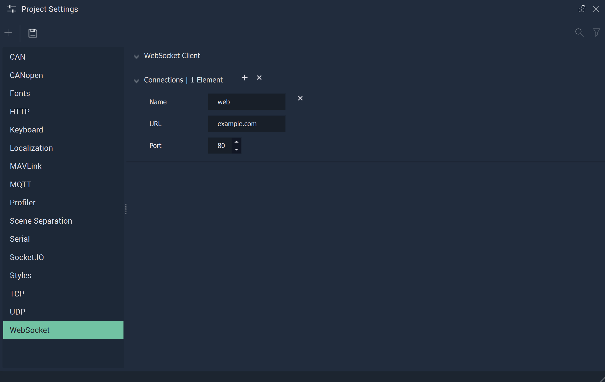

# WebSocket

The **WebSocket Settings** allow the user to manage the **WebSocket Connections** and cover the necessary data to provide functionality to the [**WebSocket Nodes**](../../toolbox/communication/websocket/README.md).

**WebSocket Communication** in **Incari** is available as a plugin and is enabled as default. However, in the case that it is disabled in the **Plugins Editor**, it will not appear in the **Project Settings**. Please refer to the [**Plugins Editor**](../plugins/communication/README.md) to find out more information.

`Name` is an identifying name of a *WebSocket* connection chosen at the user's discretion. This will show up in the [**Nodes**](../../toolbox/communication/websocket/) as a choice for the `Configuration` **Attribute**.

`URL` is the *URL* of the server.

`Port` is the port the user chooses to serve the *WebSocket* connection. This is often the same port as the website, which for _HTTP_ is 80 and for _HTTPS_ is 443.

