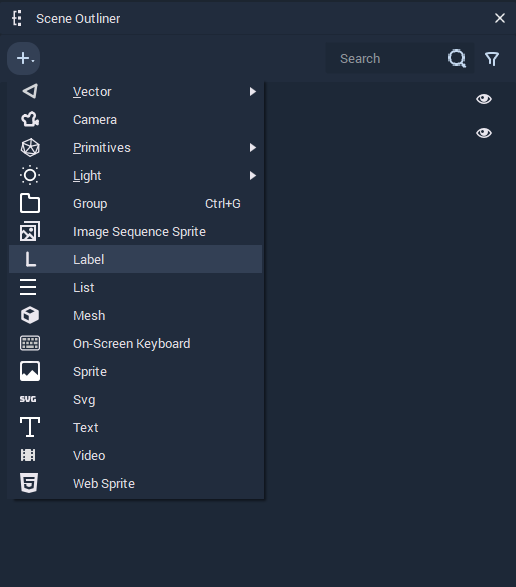
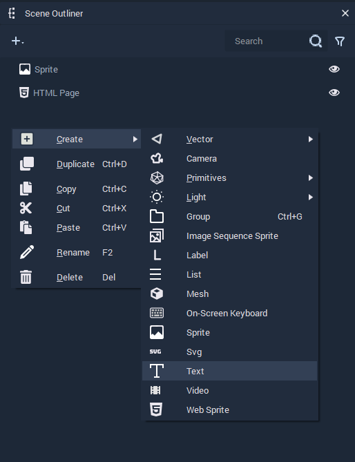
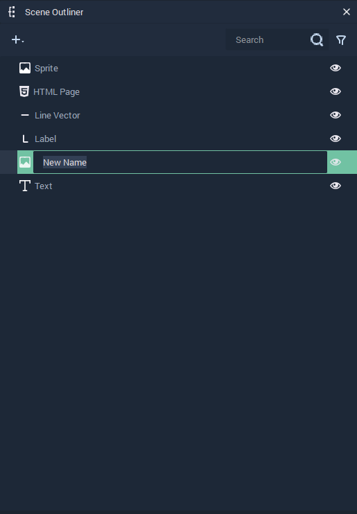

# Scene Outliner

The **Scene Outliner** contains the list of every [**Object**](../objects-and-types/scene-objects/README.md) in the currently selected [**Scene**](../objects-and-types/project-objects/scene.md). It can be used to organize, manage, create, delete, and edit them.

This page describes all the options available in the **Scene Outliner** for managing **Objects** in a **Scene**:

- [Scene Outliner](#scene-outliner)
  - [Create](#create)
  - [Prefabs](#prefabs)
  - [Duplicate](#duplicate)
  - [Copy, Cut, and Paste](#copy-cut-and-paste)
  - [Rename](#rename)
  - [Delete](#delete)
  - [Show and Hide](#show-and-hide)
  - [Search](#search)
  - [Filter](#filter)
  - [See Also](#see-also)

<figure><figcaption>
<b>Scene Outliner</b>.
</figcaption></figure>
<figure><figcaption>
Pop-up menu with options to manage <b>Objects</b>.
</figcaption></figure>

## Create

New **Objects** can be created in the following ways:

* Click on the plus  (4) (4) (4) (4) (4) (4) (4) (1) (2) (1).PNG>) icon located at the top left corner of the **Scene Outliner** and select the **Object** to create.

* Right-click inside the **Scene Outliner**, select `Create` from the pop-up, and click on the **Object**.

## Prefabs

## Duplicate

## Copy, Cut, and Paste

## Rename

**Objects** can be renamed by right-clicking an item and selecting `Rename`. You can then type a new name and press **`⏎`**/`Return` to confirm the change.

## Delete

**Objects** can be deleted in the following ways:

* Right-click on an item and select the `Delete` button from the pop-up.
* Select an item and press `del`.

## Show and Hide

**Objects** can be shown or hidden at the start of a **Scene**.

To hide an **Object**, click on the eye icon at the right of it.

And to show a hidden **Object**, click on the crossed eye icon at the right of it.

## Search

## Filter

## See Also

* [**Scene**](../objects-and-types/project-objects/scene.md)
* [**Scene Objects**](../objects-and-types/scene-objects/)
