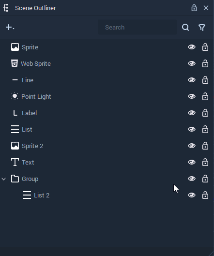
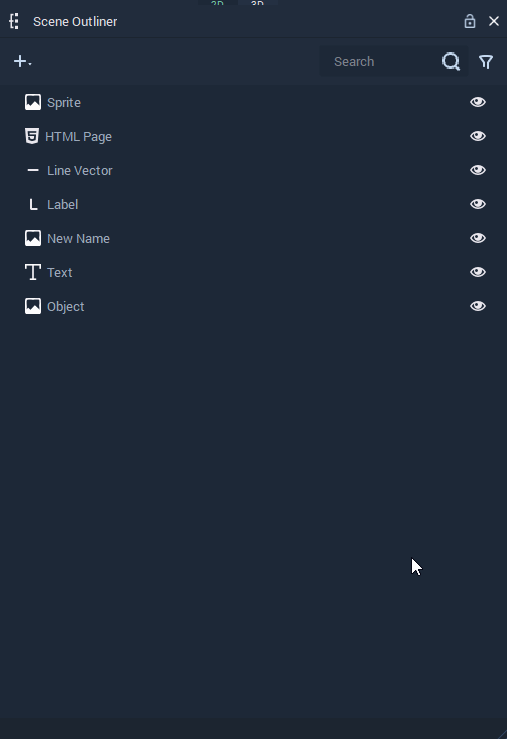

# Scene Outliner

The **Scene Outliner** contains the list of every [**Object**](../objects-and-types/scene-objects/README.md) in the currently selected [**Scene**](../objects-and-types/project-objects/scene.md). It can be used to organize, manage, create, delete, and edit them.

<figure><figcaption>
<b>Scene Outliner</b>.
</figcaption></figure>
<figure><figcaption>
Pop-up menu with options to manage <b>Objects</b>.
</figcaption></figure>

This page describes all the options available in the **Scene Outliner** for managing **Objects** in a **Scene**:

<!-- no toc -->
* [**Create**](#create)
* [**Prefabs**](#prefabs)
* [**Duplicate**](#duplicate)
* [**Copy, Cut, and Paste**](#copy-cut-and-paste)
* [**Rename**](#rename)
* [**Delete**](#delete)
* [**Show and Hide**](#show-and-hide)
* [**Search**](#search)
* [**Filter**](#filter)

## Create

New **Objects** can be created in the following ways:

* Click on the plus  (4) (4) (4) (4) (4) (4) (4) (1) (2) (1).PNG>) icon located at the top left corner of the **Scene Outliner** and select the **Object** to create.

* Right-click inside the **Scene Outliner**, select `Create` from the pop-up, and click on the **Object**.

<figure><figcaption>
Creating an <b>Object</b> with the plus icon.
</figcaption></figure>
<figure><figcaption>
Creating an <b>Object</b> from the pop-up menu.
</figcaption></figure>

## Prefabs

The pop-up menu that appears by right-clicking on the **Scene Outliner** offers three options relating to **Prefabs**. 

* `Make prefab`: The selected **Objects** turn into a **Prefab**.
* `Unpack prefab`: The selected **Prefab Instance** is unpacked, thus the **Objects** that compose it remain in the **Scene** but no longer are a **Prefab Instance**.
* `Edit prefab`: This will open the **Prefab View**, where the [**Prefab Asset**](../objects-and-types/prefabs/creating-and-using-prefabs.md#editing-the-prefab-asset) can be edited 

<figure><figcaption>
Creating a <b>Prefab</b> from <b>Objects</b> in the <b>Scene</b>.
</figcaption></figure>
<figure><figcaption>
Unpacking a <b>Prefab</b>.
</figcaption></figure>
<figure><figcaption>
Creating an <b>Object</b> from the pop-up menu.
</figcaption></figure>

For more details, see the [**Prefabs**](../objects-and-types/prefabs/README.md) section.

## Duplicate

## Copy, Cut, and Paste

## Rename

**Objects** can be renamed by right-clicking an item and selecting `Rename`. You can then type a new name and press **`⏎`**/`Return` to confirm the change.

## Delete

**Objects** can be deleted in the following ways:

* Right-click on an item and select the `Delete` button from the pop-up.
* Select an item and press `del`.

## Show and Hide

**Objects** can be shown or hidden at the start of a **Scene**.

To hide an **Object**, click on the eye icon at the right of it.

And to show a hidden **Object**, click on the crossed eye icon at the right of it.

## Search

## Filter

## See Also

* [**Scene**](../objects-and-types/project-objects/scene.md)
* [**Scene Objects**](../objects-and-types/scene-objects/)
