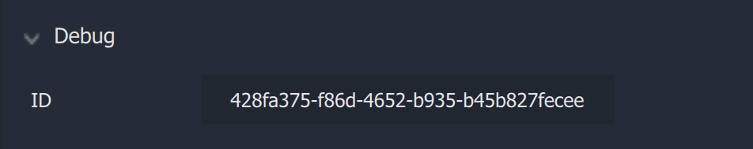

# Debug ID

All **Objects** in **Incari** have a **Debug ID**.

This **ID** can be used for scripts created in *Python* using the [**Testing API**](../../../demo-projects/testing-api.md) and importing the **incari Module**. This is useful for automation as well as testing. To reiterate, the creation of these scripts is *not* done within **Incari Studio** but externally using *Python*. 