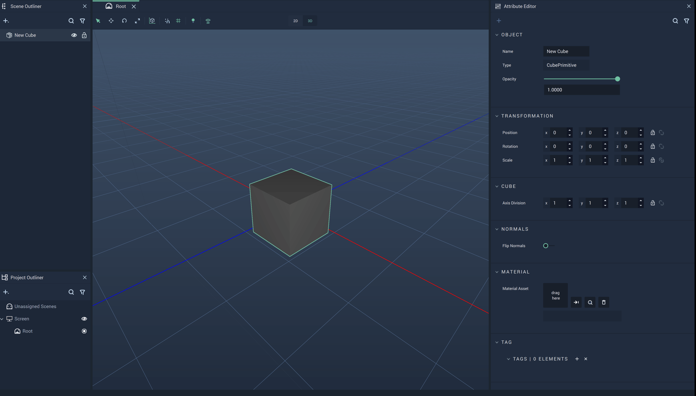
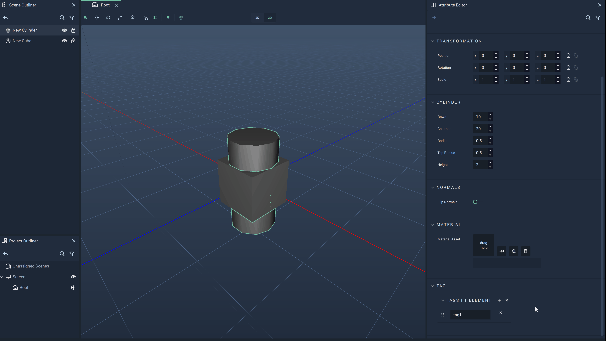

# Tag

All **Scene Objects** in **Incari** can be defined by *tags*. These *tags* act as metadata which can later be used to identify that **Object** with a specified *tag*. 

Here, the **Object** has two *tags* called `a_tag` and `another_tag`. 

# Create

To create *tags*, the user simply needs to locate the `Tag` **Attribute** towards the bottom of the **Attribute Editor**, while the desired **Object** is selected. There, one simply needs to add an `Element` by clicking the plus icon. As seen in the example above, it is possible for one **Object** to have multiple *tags*. Similarly, it is possible for multiple **Objects** to share the same *tag(s)*. 

# Delete

To delete a *tag*, the user only needs to click the remove icon to the right of the *tag*. 

# Nodes

There are several **Nodes** that also deal with *tags*. These are [**Add Tag**](../../../toolbox/incari/object/add-tag.md), [**Get Objects By Tag**](../../../toolbox/incari/object/get-objects-by-tag.md), and [**Remove Tag**](../../../toolbox/incari/object/remove-tag.md). 

It is important to note that *tags* added with the **Nodes** are treated separately from *tags* added in the `Attributes`. This is because the *tag* is only added once executed in the **Incari Player** and does not interact in any way with the *tags* added in the **Atribute Editor**. So if a *tag* is added by a **Node**, it will not appear under the `Tag` **Attribute**. 

