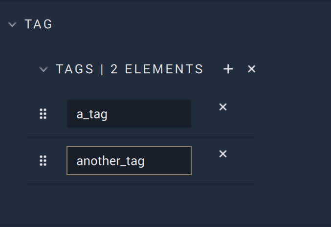
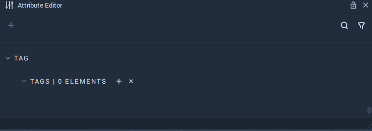
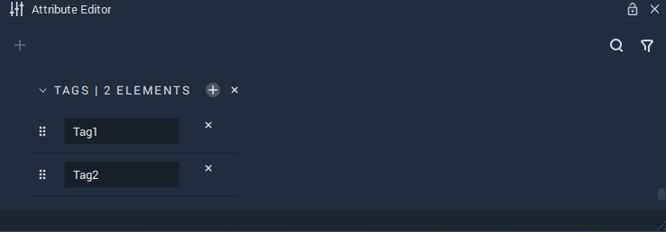

# Tag

*Tags* are labels that characterize **Objects**. These *tags* act as metadata which can later be used to identify those **Objects** with a specified *tag*. They are managed in the **Attribute Editor**, where they can be [created](#create), [deleted](#delete), and edited. Further changes can be done in the **Logic** using the [**Tag Nodes**](#tag).

The purpose of *tags* is to group **Objects** under a label. For example, several **Objects** sharing certain property can be grouped under a common *tag*, this allows for easy filtering in case **Objects** with this property are needed. Furthermore, *tags* give the user complete freedom as any set of **Objects** can share a *tag* and **Objects** can have several **tags**.

Here, the **Object** has two *tags* called `a_tag` and `another_tag`. 

## Create

To create *tags*, the user simply needs to locate the `Tag` **Attribute** towards the bottom of the **Attribute Editor**, while the desired **Object** is selected. There, one simply needs to add an `Element` by clicking the plus icon. As seen in the example above, it is possible for one **Object** to have multiple *tags*. Similarly, it is possible for multiple **Objects** to share the same *tag(s)*. 

## Delete

To delete a *tag*, the user only needs to click the remove icon to the right of the *tag*. 

## Tag Nodes

There are several **Nodes** that deal with *tags*. These are:

* [**Add Tag**](../../../toolbox/incari/object/add-tag.md), which adds a *tag* to an **Object**.
* [**Get Objects By Tag**](../../../toolbox/incari/object/get-objects-by-tag.md), which gives all **Objects** that share a specified *tag*.
* [**Remove Tag**](../../../toolbox/incari/object/remove-tag.md), which removes a *tag* from an **Object**.

It is important to note that *tags* added with the **Nodes** are treated separately from *tags* added in the `Attributes`. This is because the *tag* is only added once executed in the **Incari Player** and does not interact in any way with the *tags* added in the **Atribute Editor**. So if a *tag* is added by a **Node**, it will not appear under the `Tag` **Attribute**. 

