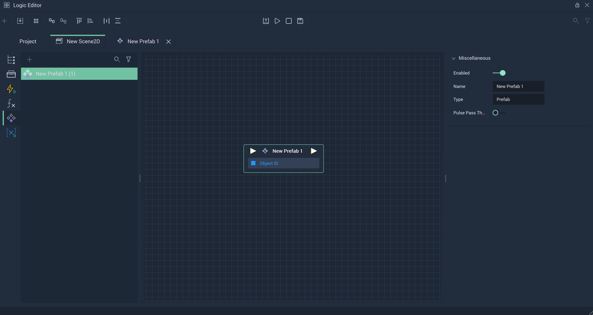
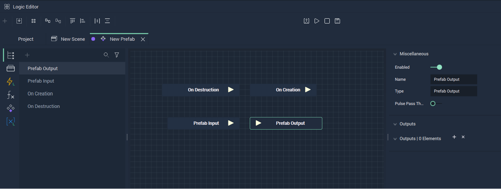
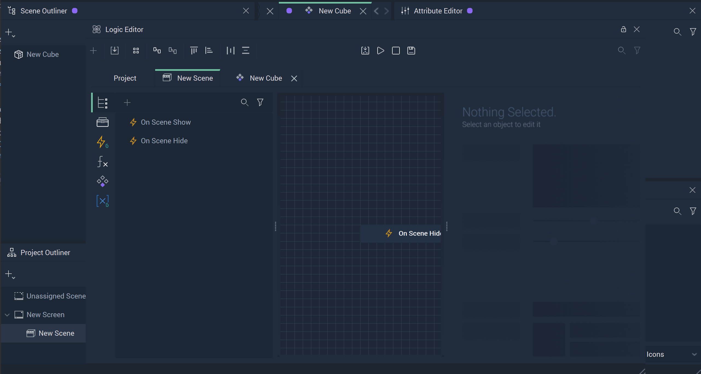
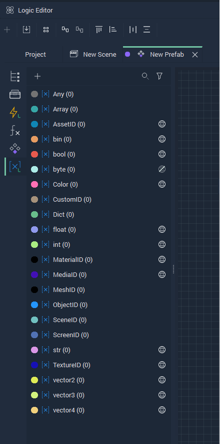
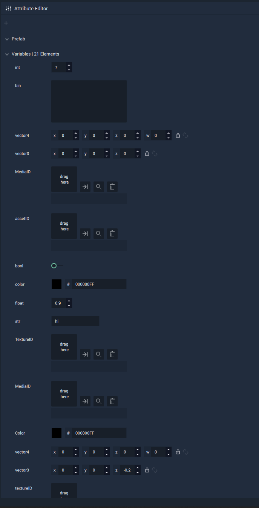

# Logic

**Prefabs** contain their own **Logic** and it applies to all instances of the **Prefab**. The **Prefab** **Logic** can be incorporated into the **Scene Logic** via a **Prefab Node**, which can be found in the **Logic Editor** by choosing the **Prefab** tab on the left Menu.

To open the **Prefab Logic** graph in the **Logic Editor** either double-click the **Prefab Node** in the **Logic Editor** or the **Prefab Asset** in the **Asset Manager**. The user can then get started with:

* [**Nodes**](logic-prefabs.md#nodes)

* [**Variables**](logic-prefabs.md#variables)

## Nodes 

The **Prefab Logic** has four **Nodes** by default: **Prefab Input**, **Prefab Output**, **On Creation**, and **On Destruction**. These represent the **Input** and **Output** of the **Prefabs** as well as two events on the creation and destruction of the **Prefab Node**, respectively.

The **Input** and **Output** **Nodes** can have their **Attributes** customized: **Input Sockets** can be added to the **Prefab Input** **Node** and **Output Sockets** to the **Prefab Output** **Node**. These changes will then be reflected in the **Prefab Node**.

The **On Creation Event Node** is triggered once the **Prefab** is created in the **Scene**, which happens when the **On Scene Show Event Node** is fired or when an **Object** is created dynamically via **Logic**.

The **On Destruction Event Node** is triggered once the **Prefab** is destroyed in the **Scene**, which happens after the **Scene** is unloaded with [**Unload Scene**](../../toolbox/incari/screen/unloadscene.md) or when the **Object** is destroyed via **Logic** with the **Destroy** **Object** **Node**.

## Variables

It is possible to expose every **Prefab** **Variable's** default value to be set per instance from the **Attribute Editor** of the **Prefab Instance**. Currently only these **Variable** types are supported for this feature: **AssetID**, **Binary**, **Boolean**, **Byte**, **Color**, **Float**, **Integer**, **MaterialID**, **MediaID**, **String**, **TextureID** and *Vectors*. 

The user must first access the **Prefab** tab of the **Logic** **Editor**, click on the **Variables** tab, and then click on `Expose Icon` of an already existing variable. If the `Expose Icon` is enabled for a **Variable**, then every instance of the **Prefab** has an `Entry` in its **Attribute Editor** under `Prefab → Variables` that shows the default value of the **Variable** that is settable as well. 

The image below showcases all **Variable** types created in the **Prefabs’s Logic Editor**. However only the **Variables** having the `Expose/Hide Icon` are the ones that can be visible in the **Attribute Editor** of the **Prefab's** **Instances**. For example, the **Variable** named `Byte` of type **Byte** will not be visible because its `Expose Icon` has been disabled.

The next image shows how these **Variables** will be shown in the **Attribute Editor** of each instance of the **Prefab** where the user can set their default values. This is accessed by simple clicking on the **Prefab Instance** in the **Scene Outliner** and locating the **Attribute Editor**. 

## Animation

Animating **Prefabs** requires a certain process within **Incari Studio**. More information can be found [here](../../toolbox/incari/animation/playanimation.md#prefabs).