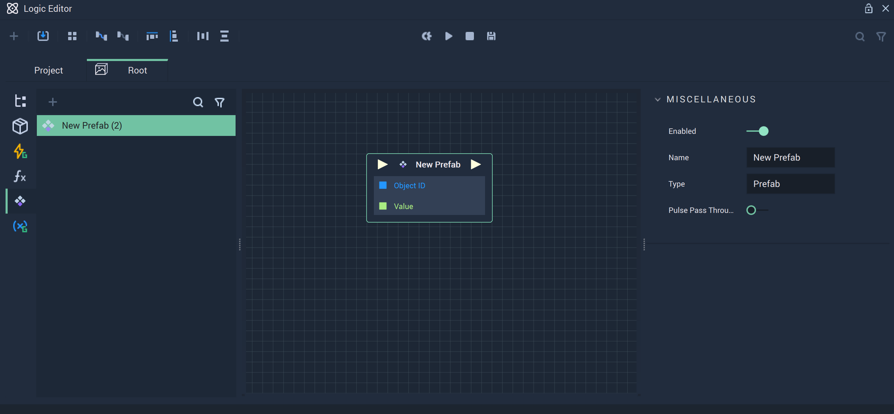

# Logic

**Prefabs** contain their own **Logic** and it applies to all instances of the **Prefab**. The **Prefab** **Logic** can be incorporated into the **Scene Logic** via a **Prefab Node**, which can be found in the **Logic Editor** by choosing the **Prefab** tab on the left Menu.

To open the **Prefab Logic** graph in the **Logic Editor** either double-click the **Prefab Node** in the **Logic Editor** or the **Prefab Asset** in the **Asset Manager**.

The **Prefab Logic** has four **Nodes** by default: **Prefab Input**, **Prefab Output**, **On Creation**, and **On Destruction**. These represent the **Input** and **Output** of the **Prefabs** as well as two events on the **Creation** and **Destruction** of the **Prefab Node**, respectively.

The **Input** and **Output** **Nodes** can have their **Attributes** customized: **Input Sockets** can be added to the **Prefab Input** **Node** and **Output Sockets** to the **Prefab Output** **Node**. These changes will then be reflected in the **Prefab Node**.

The **On Creation Event Node** is triggered once the **Prefab** is created in the **Scene**, which happens when the **On Scene Show Event Node** is fired or when an **Object** is created dynamically via **Logic**.

The **On Destruction Event Node** is triggered once the **Prefab** is destroyed in the **Scene**, which happens after the **Scene** is unloaded or when the **Object** is destroyed via **Logic** with the **Destroy** **Object** **Node**.