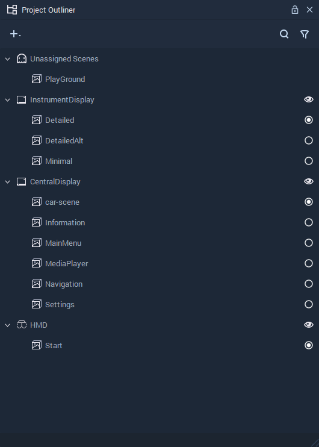

# Project Objects

**Project Objects** are the types of **Objects** that appear in the **Project Outliner**. These are the **Scene Object**, which is a **Collection** of **Objects** that belong to a unique section of your *Interface*, the **Scene2D Object**, which is a *2D* version of a **Scene**, and the **Screen Object**, which defines the target display specifications.

Read more about these **Objects** here:

* [**Scene**](scene.md)
* [**Scene2D**](scene2d.md)
* [**Screen**](screen.md)
* [**HMD**](hmd.md)

