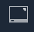

# Screen

The **Screen Object** in **Incari** contains the technical specifications of the physical display that the **Project** will ultimately be displayed on. In addition, it also has **Attributes** relating to the virtual **Camera** and rendering.

## Attributes

A **Screen's Attributes** can be edited by selecting it in the **Project Outliner** and adjusting them in the **Attribute Editor**, like you would with **Scene Objects**.

### Simulation Window

`Size` defines the size of the **Simulation Window**, in pixels.

`Position` defines the offset position, in pixels, that the **Simulation Window** will be displayed on your monitor. This means that when you are working on a multi-display system, you can preview **Screens** on separate parts of your monitor.

By default, the **Simulation** will be shown in the left-hand corner of your monitor \(0, 0\), with `x` representing the number of pixels between the left-hand side of the **Simulation** window and the left hand side of your monitor, and `y` representing the number of pixels between the top of the window and top of your monitor.

`Scale factor`: The factor by which the **Simulation Window** will be scaled.

`Window Mode`: The mode in which the **Simulation Window** will be displayed. The available options are: `Full screen`, `Hidden`, `Windowed`, `Windowed full screen`.

`Enable VSync`: Whether *Vertical Synchronization* will be enabled. *Vertical Synchronization* synchronizes *frame rate* of the **Simulation** with the *refresh rate* of the monitor that displays it.

`Enable Decoration`: Whether the **Simulation Window** will have a *title bar*.

### Background

The `Mode` **Attribute** defines the background of the **Simulation** and can be a `Color`, `Texture`, `Scene Environment`, or `Gradient`. It can also be completely transparent if `Color` is selected and alpha channel (`A:`) is set to 0. 

An example of a `Color Background` with one **Sphere** in the one **Scene**:

An example of a `Texture Background` with one **Sphere** in the one **Scene**:

An example of a `Scene Environment Background` with one **Sphere** in the one **Scene**:

An example of a `Gradient Background` with one **Sphere** in the one **Scene**:

### Anti-Aliasing

**FXAA**

**Fast Approximate Anti-Aliasing** \(**FXAA**\) is a post-processing effect, which detects edges in an image and smooths them. This _may_ help improve how *2D* and *3D* **Objects** are displayed. _After_ each frame has been rendered, the effect is applied per-pixel and doesn't consider *3D* geometry or know what should be smoothed and what shouldn't. As a result, it may unintentionally smooth the wrong parts of the image and may not be the best option. It is often a trade-off between improved smoothness of jagged areas of geometry at the loss of some crispness of textures.

`Mode` changes the way the effect is calculated, so you can choose between speed (`fast`) and image crispness (`accurate`), the latter of which may give better results at the expense of some calculation speed.

`Enabled` enables/disables the effect entirely. Disabling the effect is the most performant option, and should be considered if it isn't necessary or you are having performance issues. The **FXAA** doesn't consider movement at all, and may produce undesirable results in cases where you have fast moving objects.

### SSAO

**Screen Space Ambient Occlusion** \(**SSAO**\) is a post-processing effect, which takes both the _depth_, and _normal_ information of *3D* geometry within a **Scene**, to approximate areas of occlusion and exposure to ambient light. What this means is that areas such as corners and cavities are darker, creating a more realistic representation of the way light behaves in the real world.

Like **FXAA**, the effect can be disabled/enabled by toggling the `Enabled` option, but it also has a few extra **Attributes** to consider.

`Radius` defines the spread of darkened areas, with a lower value resulting in smaller, crisper occluded areas, and bigger values producing a darker, but softer result.

`Samples` defines the amount of samples to be used in the calculation, with lower values being cheaper in terms of processing time required, at the expense of quality. Higher samples invariably give a better result, but you also sacrifice performance. It often comes down to adjusting the `Radius` and `Samples` values to find the right balance between quality and performance.

### Lensflare

*Lens flares* are an *artifact* in an image consisting of hazy rings or circles that occur when a bright light source shines directly into the **Camera** lens. Enabling this option will simulate this effect in the **Screen**.

### Bloom

*Bloom* creates the effect of light bleeding from bright areas onto their surroundings. Hence, when *Bloom* is enabled, fringes of light extend from the border of these bright areas, thus simulating the effect perceived in real-life camera lenses.

The way this effect is achieved is by blurring and brightening the areas with a luminosity over a certain threshold.

Furthermore, there are two customizable **Attributes** for this effect:

* `Blur Repeat`: Number of times that the *blur* effect is applied over the part of the image trespassing the `Luminance Threshold`.

* `Luminance Threshold`: Threshold over which the effect is applied. The areas whose luminosity exceeds this value are blurred and brightened to achieve the desired effect.

