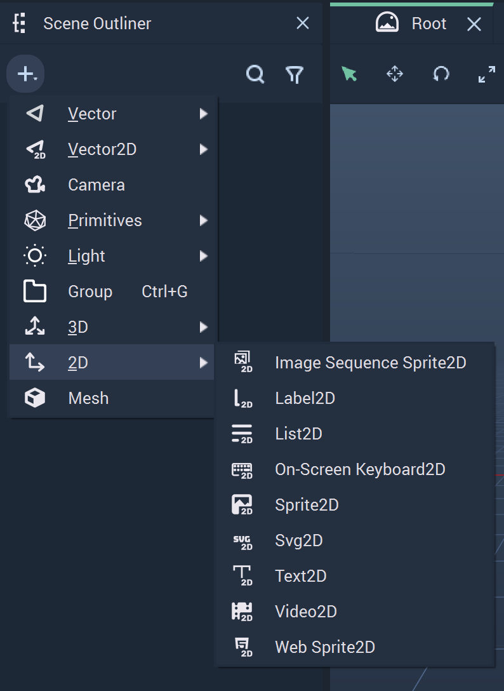

# 2D Objects

There are several **Objects** in **Incari** which can be created in either *3D* or *2D*. These add important visual tools for a *User Interface's* functionality. This page focuses on the *2D* versions of these components. 

The **2D Objects** are:

* [Image Sequence Sprite2D](imagesequencesprite2d.md)
* [Label2D](label2d.md)
* [List2D](list2d.md)
* [On-Screen Keyboard2D](onscreenkeyboard2d.md)
* [Sprite2D](sprite2d.md)
* [Svg2D](svg2d.md)
* [Text2D](text2d.md)
* [Video2D](video2d.md)
* [Web Sprite2D](websprite2d.md)

