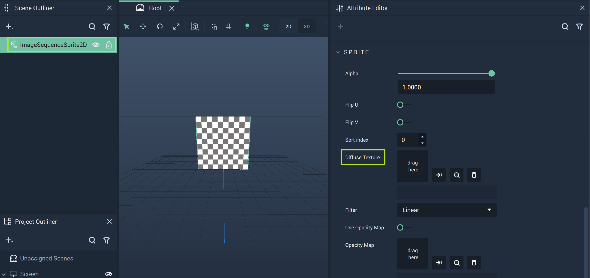
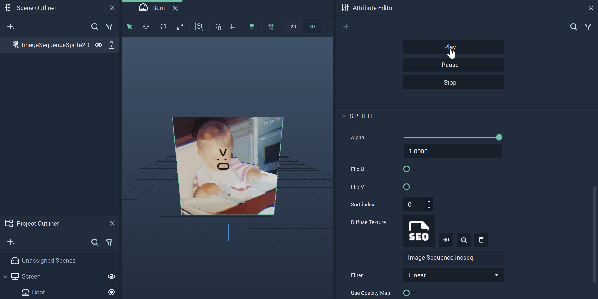

# Image Sequence Sprite2D

The **Image Sequence Sprite2D**, located under the **2D** section of the **Scene Outliner**, creates a *sprite* that acts like a canvas for an **Image Sequence Asset** to be displayed on. 

While the **Image Sequence Sprite2D** has several **Attributes** that alter its visual aspects, the most important is the `Diffuse Texture` under `Sprite`. Here the user can create a new **Image Sequence** or locate an already created one. 

Above, the `File` **Attribute** has been highlighted for the **Image Sequence Sprite2D Object**. This is where the user can select the appropriate file after activating the pop-up Menu. 

When the *.inseq* file is selected, it is displayed in the viewport of the **Scene Outliner**. 

There are several **Nodes** that are attributed to **Image Sequences**. More information can be found [here](../../../toolbox/incari/imagesequence/README.md) and [here.](../../../toolbox/events/imagesequence/README.md)