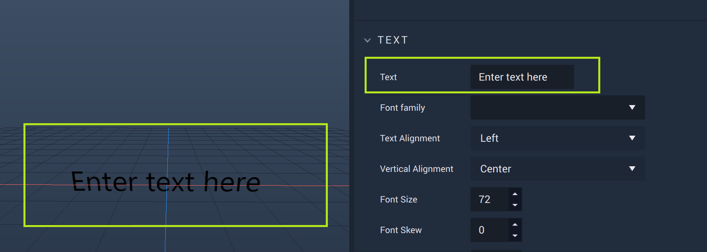
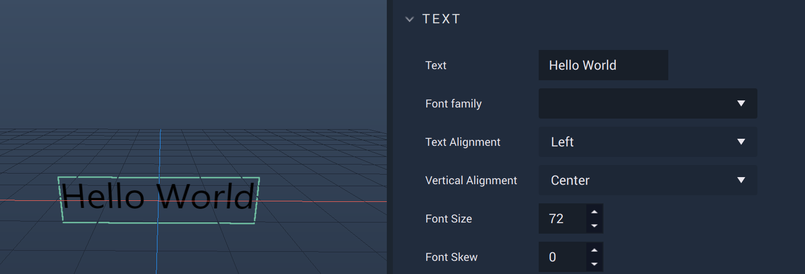

# Label2D

The **Label2D Object**, located under the **2D** section of the **Scene Outliner**, essentially acts as a text box for a label. Any text can be added to the **Label2D** using the `Text` **Attribute** in the **Attribute Editor**. 

Initially, the **Label2D** displays the text `Enter text here`.

Locating the `Text` **Attribute**, any text can be inputted to provide clear information for a *User Interface*. Here, the test text `Hello World` is supplied. 

There is also the **Get LabelText Node**. More information can be found [here.](../../../toolbox/incari/vector/label/README.md)