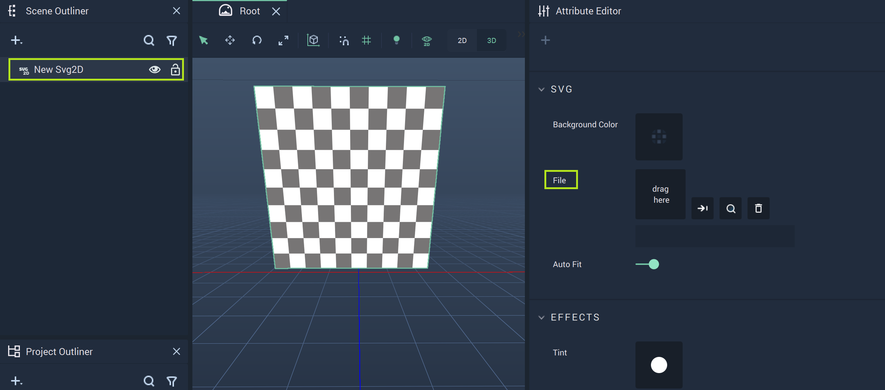
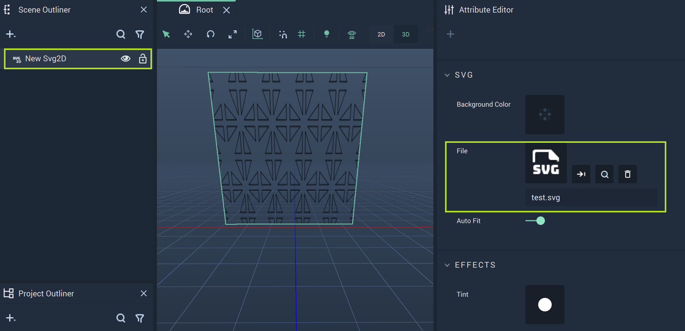

# Svg2D

The **Svg2D Object**, located under the **2D** section of the **Scene Outliner**, allows the user to display *.svg* files in the **Scene Outliner**. 

The most important **Attribute** is `File` under `SVG`. Here, the user can locate the desired *.svg* file. 

Above, the `File` **Attribute** has been highlighted for the **Svg2D Object**. This is where the user can select the appropriate file after activating the pop-up Menu. 

When the *.svg* file is selected, it is displayed in the viewport of the **Scene Outliner**. 

## External Links

* Example Svg file from [Wikipedia.](https://mathstat.slu.edu/escher/index.php/File:P4m-sample.svg)