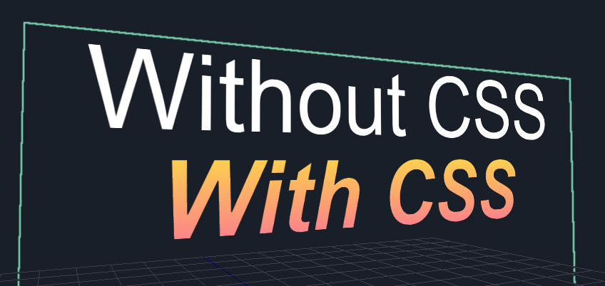
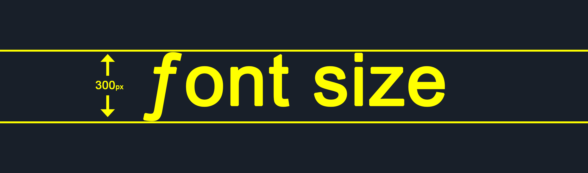

# Text2D

The **Text2D Object** is a very versatile feature of **Incari Studio**. It is located under the **2D** section of the **Scene Outliner**.

## Value

`Value` defines the text that will appear in the **Text2D Object**. This can be any sequence of characters that the font supports, including special characters such as emojis 😉.


Additionally, the `Value` **Attribute** can be used to add extra styling in the form of HTML/CSS. This is achieved using `<span>` tags and is only recommended to users who are familiar with these languages.


```markup
Without CSS
<br>
<span style="
    font-style: italic;font-weight:bold;
    background:linear-gradient(#FEE140 0%, #FA709A 100%);
    -webkit-background-clip:text;-webkit-text-fill-color:transparent;">

    With CSS
</span>
```



## Size and Resolution

Although you may already be familiar with the `Size` and `Resolution` **Attributes** of the **Camera Object**, things work slightly differently with **Text** and **Web Sprite Objects**.

With **Camera**, `Resolution` relates to the resolution of a _physical_ piece of hardware ,i.e., a display. With **Text** and **Web Sprite**, however, both `Size` and `Resolution` relate to something which exists in _virtual_ 3D space. So although, like **Camera**, the `Size` **Attribute** defines the **Object's** size in 2D space, the `Resolution` **Attribute** defines the resolution of the content that will be stretched to fit that space.

## Font Family

`Font Family` allows you to select a generic font family \(`monospace`, `serif`, `sans-serif`\) or add your own custom font.

To add a custom font, simply drag it into the **Asset Manager** from your OS file explorer. To use that font, drag it from the **Asset Manager** onto the `Font File` **Attribute** of a **Text2D Object** in the **Attribute Editor**.

## Alignment

Alignment works like any other word processor. You can align your text to be left-aligned, centre-aligned or right-aligned, using the `left`, `center`and `right`options respectively.


## Font Size

`Font Size` defines the approximate height, in pixels, from the _lowest descent_ to the _highest ascent_ of a font.



## Font Color / Background Color

**Colors** can be set in various ways in **Incari** and work very much like they do in other software. You can manually adjust the **HSB** / **RGBA** values or input a **Hex Code**, using their corresponding [**Color Attribute**](../../attributes/attribute-types/color-attribute.md).

## Sprite

Additionally, **Text2D** also shares **Common Attributes** of the **Sprite** category; which are:

* `Alpha`
* `Flip U` and `Flip V`
* `Sort Index`

There are also several **Nodes** attributed to **Text2D Objects**. More information can be found [here](../../../toolbox/incari/object/set-text.md), [here](../../../toolbox/incari/object/get-text-color.md) and [here.](../../../toolbox/incari/object/set-text-color.md)