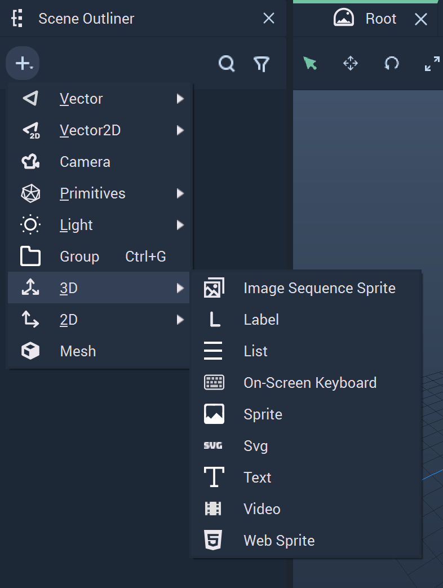

# 3D Objects

There are several **Objects** in **Incari** which can be created in either *3D* or *2D*. These add important visual tools for a *User Interface's* functionality. This page focuses on the *3D* versions of these components. 

The **3D Objects** are:

* [Image Sequence Sprite](imagesequencesprite.md)
* [Label](label.md)
* [List](list.md)
* [On-Screen Keyboard]()
* [Sprite]()
* [Svg]()
* [Text]()
* [Video]()
* [Web Sprite]()

