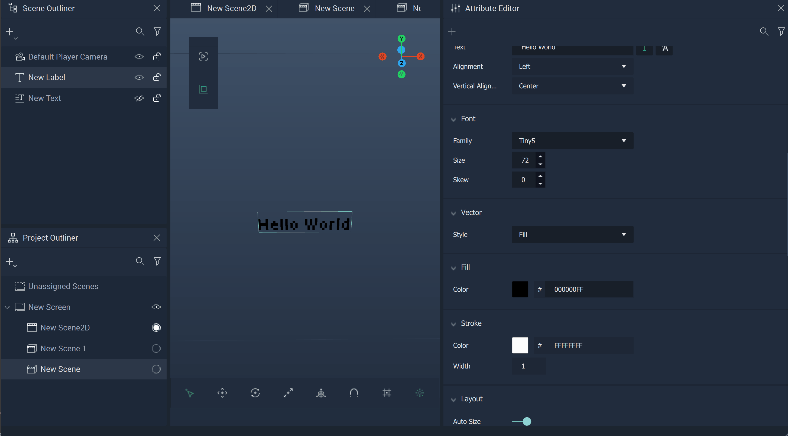

# Label

The **Label Object** essentially acts as a text box for a label. Any text can be added to the **Label** using the `Text` **Attribute** in the **Attribute Editor**. 

Initially, the **Label** displays the text `Enter text here`.

Locating the `Text` **Attribute**, any text can be inputted to provide clear information for a *User Interface*. Here, the test text `Hello World` is supplied. 

There is also the **Get LabelText Node**. More information can be found [here.](../../../toolbox/incari/vector/label/README.md)

## Translation

It is also possible to switch to `Translation` by clicking the 
right-most icon of the `Text` **Attribute**.

This lets the user access the `.local` file provided in the [**Project Settings**](../../../modules/project-settings/localization.md). The keys will appear as options in the `Translation` dropdown. The translation of the current language will be used. This is set in the **Project Settings** but can be altered with the [**Localization Nodes**](../../../toolbox/localization/README.md).

## Font

The **Font Attributes** control customizable settings of the **Label's** font. `Font Family` allows one to select a generic font family \(`Manrope` or  `Source Code Pro`\) or a custom font that has been added in [**Project Settings**](../../modules/project-settings/fonts.md). 

**Label Objects** are capable of handling [*variable fonts*](../../../modules/project-settings/fonts.md#variable-fonts) and let the user configure certain aspects, called `Parameters`. The *gif* below demonstrates what a font looks like with no `Parameters` in its **Attributes** and what it looks like when the user switches to a font that does.

