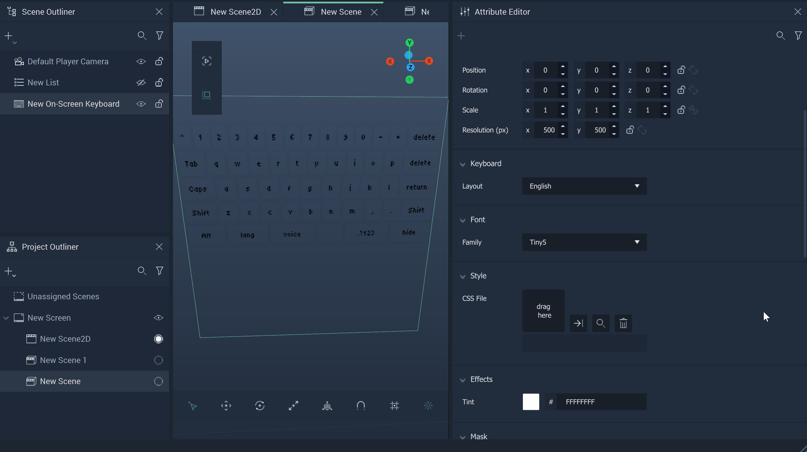

# On-Screen Keyboard

The **On-Screen Keyboard** is a keyboard that appears on the screen. It can be used by a user to incorporate a variety of functions in the _User Interface_, such as inputting text or selecting based on a specified key, directly on a screen rather than requiring additional hardware.

The two images below show an **On-Screen Keyboard** in the viewport of **Incari Studio** and the **Incari Player**.

There are several **Nodes** attributed to the **On-Screen Keyboard**. More informaton can be found [here](../../../toolbox/incari/on-screenkeyboard/) and [here.](../../../toolbox/events/on-screenkeyboard/)

Additionally, the **Project Settings** allow the user to add different [keyboard _layouts_.](../../../modules/project-settings/keyboard.md)

## Font

The **Font Attributes** control customizable settings of the **On-Screen Keyboard's** font. `Font Family` allows one to select a generic font family \(`Manrope` or  `Source Code Pro`\) or a custom font that has been added in [**Project Settings**](../../../modules/project-settings/fonts.md). 

**On-Screen Keyboard Objects** are capable of handling [*variable fonts*](../../../modules/project-settings/fonts.md#variable-fonts) and let the user configure certain aspects, called `Parameters`. The *gif* below demonstrates what a font looks like with no `Parameters` in its **Attributes** and what it looks like when the user switches to a font that does.

