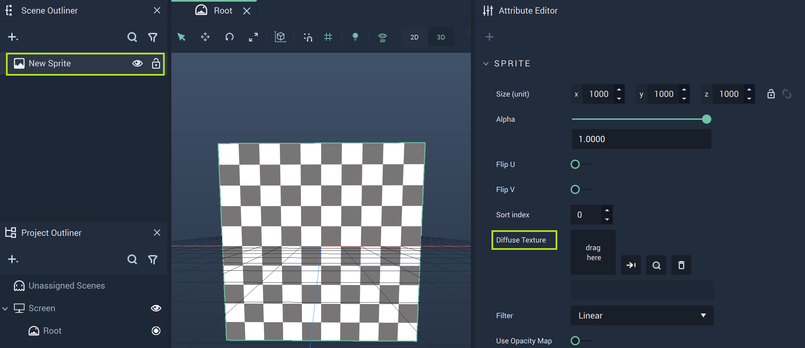
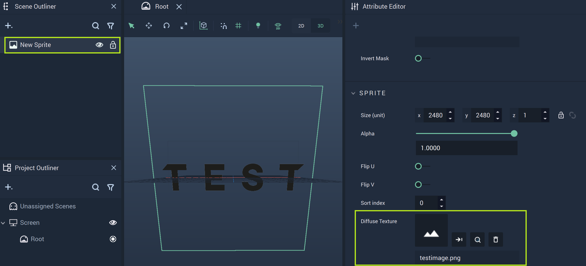

# Sprite

The **Sprite Object**, located under the **3D** section of the **Scene Outliner**, is an **Object** which acts as a canvas for an image **Asset** to be displayed on.

As **Sprite** also shares some of its **Attributes** with other **Objects**, it is discussed in detail in the [**Sprite Attributes**](../../attributes/common-attributes/sprite.md) page of the [**Common Attributes**](../../attributes/common-attributes/) section.

However, the most important **Attribute** is the `Diffuse Texture` under `Sprite`. Here the user can create a new **Image Sequence** or locate an already created one. 

Locate `Diffuse Texture` as shown above and select an **Asset** from the pop-up Menu.

Once selected, the **Asset** is displayed through the **Sprite**.

