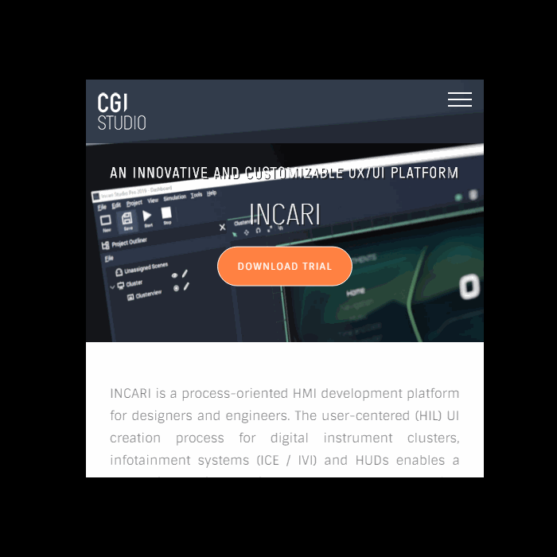

# Web Sprite

**Web Sprites** are an advanced type of **Object** which allow you to embed anything, from a small HTML widget to an entire web page, into your **Scene**. This allows integration between **Incari's** built-in **Objects** and **Logic**, and many web technologies. 

The **Web Sprite Object** is located under the **3D** section of the **Scene Outliner**.

Another important feature of the **Web Sprite Object** is that, when combined with the [**Call JavaScript Function Node**](../../../toolbox/web/call-javascript-function.md) in the **Logic Editor**, we can use evaluated data from our **Logic** as arguments for a web resource's [*JavaScript Function*](https://developer.mozilla.org/en-US/docs/Web/JavaScript/Guide/Functions).

## Web Resource

### Source Type

A **Drop-down Type Attribute**, which controls whether the web resource is a local file, or if it is hosted remotely. The value of this **Attribute** will determine whether the `File` or `URL` **Attribute** is shown in the **Attribute Editor**.

### File / URL

If the `Source Type` is set to "Local file", you will see the `File` **Attribute**, and will need to drag a `.html/.htm` file from the **Asset Manager** onto the **Attribute's** slot.

Alternatively, if it is set to "Remote URL", you should input the address of the web page that you want to be loaded.

### Scroll Speed

In cases where the `Resolution` of the **Web Sprite** is not large enough to fit the entire page, a scroll bar will be displayed. `Scroll Speed` determines the speed at which the contents of the page will be scrolled.

### Resolution and Size

`Resolution` defines the dimensions of the **Web Sprite** in pixels. This can be thought of as being like the size of your internet browser window. By resizing your browser window, you can fit in more content at a higher resolution.

`Size` defines the size of the **Object** in **Units** within 3D space. In most cases, it is recommended that this is the same value as `Resolution`, or the same aspect ratio, at the very least.

## Common Attributes

* **Object** \(All\)
* **Transformation** \(All\)
* **Rotation Pivot** \(All\)
* **Effects**:
  * `Tint`
* **Sprite**:
  * `Alpha`
  * `Flip U`
  * `Flip V`
  * `Sort Index`

