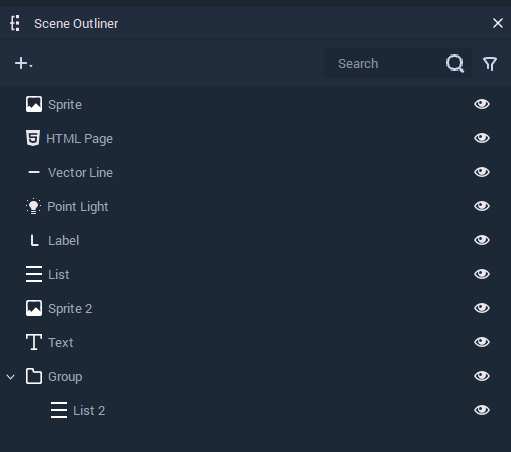
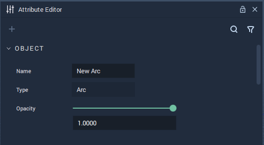
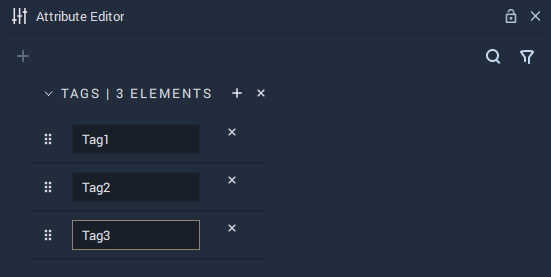
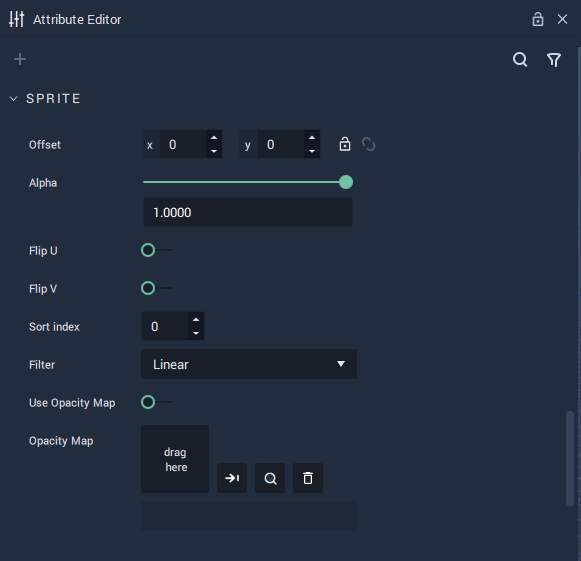
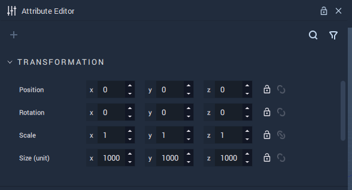

# Scene Objects

An **Object** in **Incari** is any entity which can be added to a **Scene**. "**Object**" is a broad term used to describe a number of different components, each with their own purpose, behaviors and characteristics.

For in-depth descriptions of each type of **Object**, see the [Table of Contents](#contents) below.

## Managing Objects

**Objects** in a **Scene** are managed in the **Scene Outliner**. There they can be created, deleted, edited, and organized. For more detail, see the [**Scene Outliner**](../../modules/scene-outliner.md) section.

## Attributes

**Attributes** define specific characteristics of entities in **Incari** and can be modified in the **Attribute Editor**. Particularly, there are several sets of **Attributes** that are shared throughout **Objects**. These are explained in detail in the [**Common Attributes**](../attributes/common-attributes/) section:

* [`Object`](../attributes/common-attributes/object.md): The `Name`, `Type`, and `Opacity` of an **Object** are shown here.
* [`Tag`](../attributes/common-attributes/tag.md): _Metadata_ that serves as an identifier for an **Object** or several of them.
* [`Sprite`](../attributes/common-attributes/sprite.md): They determine how an **Object** is visualized in a **Scene**.
* [`Transformation`](../attributes/common-attributes/transformation/README.md): They define the _position_ and _rotation_ of an **Object** in a **Scene**.

<figure><figcaption></figcaption></figure>
<figure><figcaption>

</figcaption></figure>

<figure><figcaption></figcaption></figure>
<figure><figcaption>

</figcaption></figure>

## Prefabs

**Prefabs** are an important and useful type of **Object**. They are composed of a combination of **Objects** and allow the user to create several **Instances** of this combination, enact changes across all of them or apply individual characteristics via overrides. For more information, see the [**Prefabs**](../prefabs/README.md) section.

## Objects in Logic

In the **Logic**, it might be necessary to make references to specific **Objects**. For this, each **Object** in a **Scene** gets assigned an **Object ID**, which is a unique identifier. The **Object ID** of an **Object** can be obtained from said **Object's** **Node**, which is created by dragging an **Object** from the **Scene Outliner** to the **Logic Editor**.

## Structure in a Scene

**Objects** in a **Scene** are organized in a _tree_. This means that every **Object** except for the [**Root Object**](#root-object) has a _parent_ and all **Objects** may have _children_. To make an **Object** the _child_ of another, simply drag it in the **Scene Outliner** and drop it in top of the **Object** that will be the _parent_.

### Root Object

Every **Scene** has a **Root Object**, which is the _parent_ of all **Objects** that are on the first hierarchy level. Thus, all **Objects** in a **Scene** are _descendants_ of the **Root Object**. To obtain the **Object ID** of the **Root Object**, use the [**Get Root** **Node**](../../toolbox/incari/object/get-root.md).

## Contents

* [**Camera**](camera.md)
* [**Group**](group.md)
* [**List**](list-widget.md)
* [**Mesh**](mesh.md)
* [**Lights**](lights.md)
* [**Sprite**](sprite.md)
* [**Text**](text.md)
* [**Web Sprite**](web-sprite.md)
* [**Primitives**](primitives.md)
* [**Screen Space Elements**](screen-space-elements.md)
