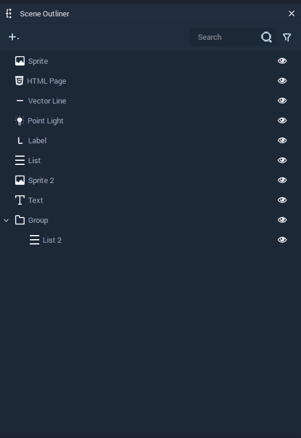
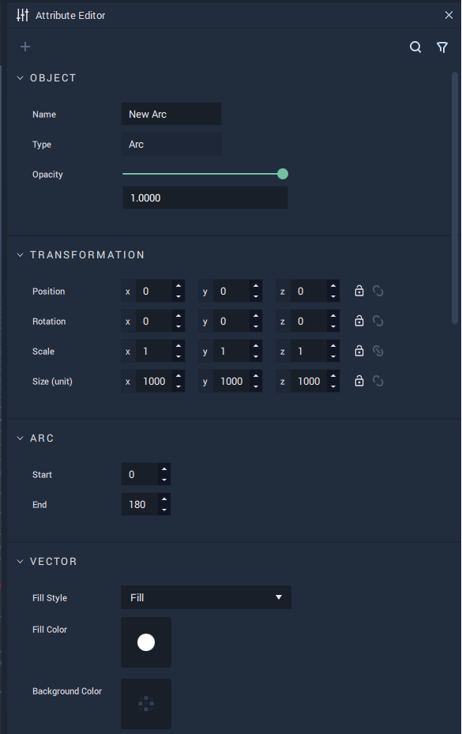
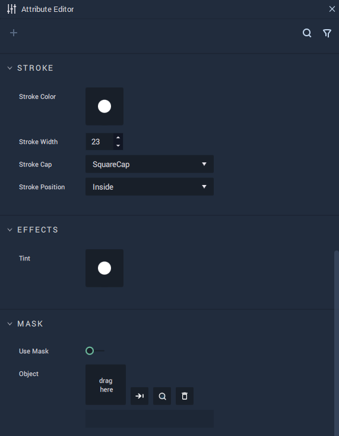
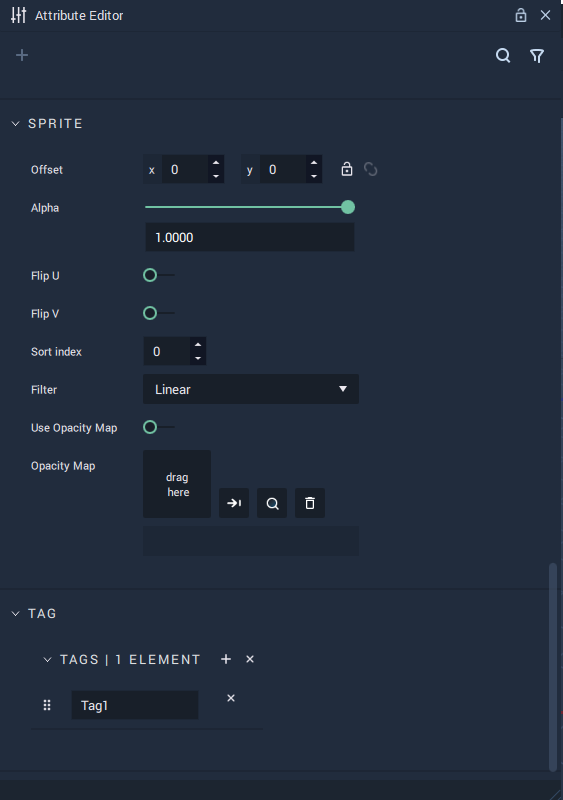
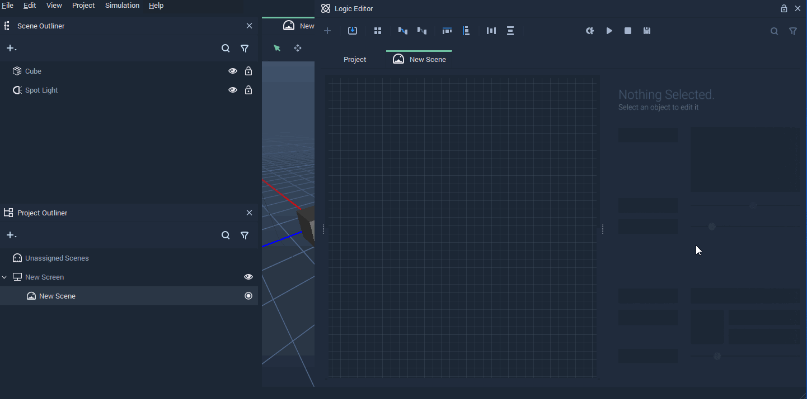
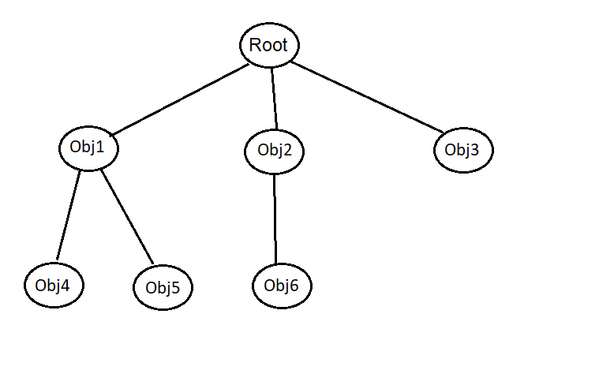

# Scene Objects

An **Object** in **Incari** is any entity which can be added to a **Scene**. "**Object**" is a broad term used to describe a number of different components, each with their own purpose, behaviors and characteristics.

## Managing Objects

**Objects** in a **Scene** are managed in the **Scene Outliner**. Here they can be created, deleted, managed, and organized. For more detail, see the [**Scene Outliner**](../../modules/scene-outliner.md) section.

## Attributes

**Attributes** define specific characteristics of entities in **Incari** and can be modified in the **Attribute Editor**. Particularly, there are several sets of **Attributes** that are shared throughout **Objects**. These are explained in detail in the [**Common Attributes**](../attributes/common-attributes/) section:

* [`Object`](../attributes/common-attributes/object.md): The name and type of an **Object** is shown here.
* [`Tag`](../attributes/common-attributes/tag.md): _Metadata_ that serves as an identifier for an **Object** or several of them.
* [`Sprite`](../attributes/common-attributes/sprite.md):
* [`Transformation`](../attributes/common-attributes/transformation/README.md): They define the _position_ and _rotation_ of an **Object** in a **Scene**.

<figure><figcaption></figcaption></figure>
<figure><figcaption>
Object Attributes.
</figcaption></figure>
<figure><figcaption></figcaption></figure>

## Prefabs

**Prefabs** are an important and useful type of **Object**. They are composed of a combination of **Objects** and allow the user to create several **Instances** of this combination, enact changes across all of them or apply individual characteristics via overrides. For more information, see the [**Prefabs**](../prefabs/README.md) section.

## Objects in Logic

## Structure

**Objects** in a **Scene** are organized in a _tree_...

### Root Object

## Contents

* [**Camera**](camera.md)
* [**Group**](group.md)
* [**List**](list-widget.md)
* [**Mesh**](mesh.md)
* [**Lights**](lights.md)
* [**Sprite**](sprite.md)
* [**Text**](text.md)
* [**Web Sprite**](web-sprite.md)
* [**Primitives**](primitives.md)
* [**Screen Space Elements**](screen-space-elements.md)
